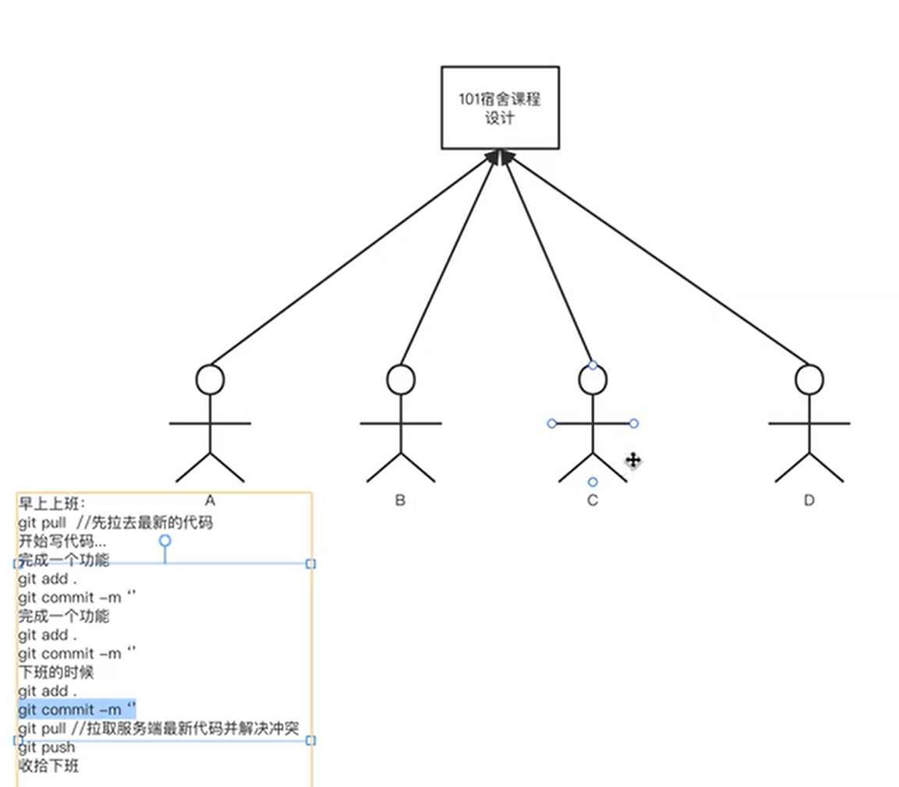
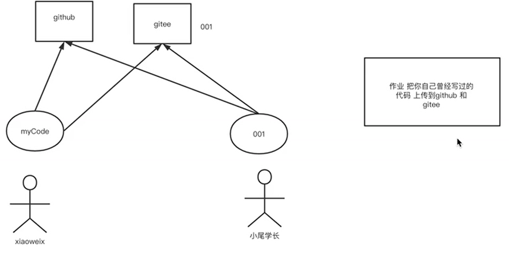
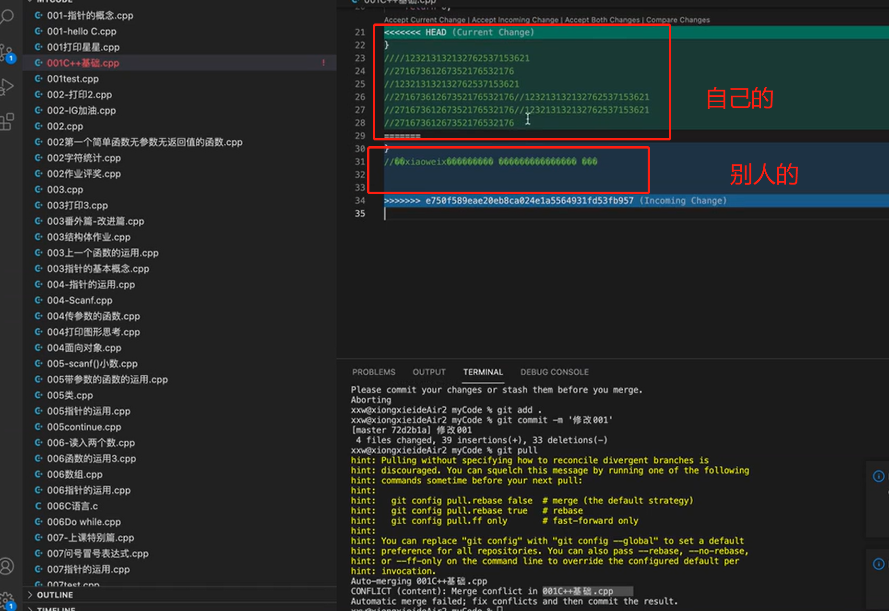
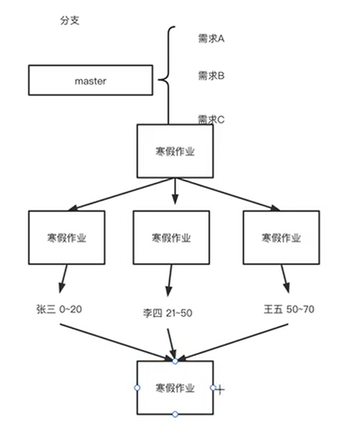

## Git的安装与配置

### （1） Git的配置

在 ~/.gitconfig中

```
git config --global user.name 你的英文名 lam
git config --global user.email 你的邮箱 
git config --global push.default simple # 配置git的默认，默认是Matching,此行为会push所有分支，simple只会push当前分支 
git config --global core.quotepath false # 防止文件名变成数字
git config --global core.editor "vim" # 使用vim编辑提交信息
```


### （2） 命令介绍

```
1.git init，初始化本地仓库 .git

2.git status -sb，显示当前所有文件的状态

3.git log 查看变更历史

4.git add 文件路径，用来将变动加到暂存区

5.git commit -m "信息"，用来正式提交变动，提交至 .git 仓库

6.如果有新的变动，我们只需要依次执行 git add xxx 和 git commit -m 'xxx' 两个命令即可。别看本教程废话那么多，其实就这一句有用！先 add 再 commit，行了，你学会 git 了。

7.git clone git@github.com:xxxx，下载仓库

8.history 是显示历史的命令
```


### （3） 使用git

**使用总结**

```
1、从github或者gitee下载代码
git clone git@github.com:msclam/blog.git

2、上传我们的代码到github或者gitee中
git add .
git commit . -m "信息"
git pull 从服务器中拉代码
git push 推送代码到github或者gitee中

3、合作发生冲突时
别人修改了代码，但是自己没有先pull,自己也修改了代码，然后pull的时候，会要求你先添加到暂存区+本地仓库add和commit
然后如果pull产生conflict的话，需要处理冲突,head的部分是自己的修改地方，解决冲突之后重新提交

4、个人新建仓库并往上面推代码
创建仓库
git init
git add .
git commit . -m ""
git remote add origin git@github.com:msclam/blog.git  // 添加远程仓库
git push -u origin master// 如果没有推上去 git push --set-upstream origin master

已经有就只需要后两句

5、添加一个新的远程仓库
git remote add github https://github.com/msclam/blog.git
git remote -v // 查看自己有哪些远程仓库
git push github master

6、回退版本
git log之后退出按q
git reset --hard HEAD^  //回退到上一个版本
git reset --hard HEAD~n //回退到n次以前的版本
git reset --hard commit号  //回退到指定的版本

7、分支
git checkout test // 切换分支
合并到master
git checkout master
git merge test
git push
```

#### 日常工作的流程

上班先git pull然后git add commit，下班git pull，然后解决冲突，最后git push



#### 关于推送不同的仓库



#### 关于冲突



#### 关于分支



