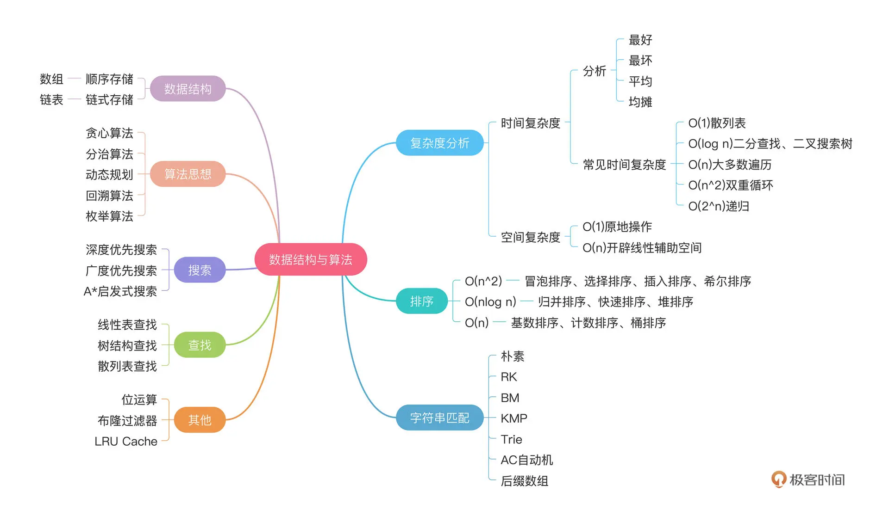

# LeetCode <<剑指offer>>

排序、哈希、二分（查找）、搜索（BFS、DFS）、动态规划、kmp、贪心、回溯、分治

<!-- more -->

## 03 数组的重复的数字

```java
找出数组中重复的数字。

在一个长度为 n 的数组 nums 里的所有数字都在 0 ～ n-1 的范围内。数组中某些数字是重复的，但不知道有几个数字重复了，也不知道每个数字重复了几次。请找出数组中任意一个重复的数字。
    
方式一： 原地hash
for (int i = 0; i < nums.length; i++ ) {
    if (nums[i] == i) continue;
    if (nums[i] == nums[nums[i]]) return nums[i];
    swap(nums, nums[i], nums[nums[i]]);
}
return -1;    
    
class Solution {
    public int findRepeatNumber(int[] nums) {
        for (int i = 0, n = nums.length; i < n; ++i) {
            while (nums[i] != i) {
                if (nums[i] == nums[nums[i]]) return nums[i];
                swap(nums, i, nums[i]);
            }
        }
        return -1;
    }

    private void swap(int[] nums, int i, int j) {
        int t = nums[i];
        nums[i] = nums[j];
        nums[j] = t;
    }
}

方式二： 排序
		Arrays.sort(nums);
        for (int i = 0; i < nums.length; i ++ ) {
            if (i > 0 && nums[i] == nums[i - 1]) {
                return nums[i];
            }
        }
        return -1;

方式三： map
        Map<Integer, Integer> mp = new HashMap<>();
        for (int i = 0; i < nums.length; i ++ ) {
            mp.put(nums[i], mp.getOrDefault(nums[i], 0) + 1);
        }
        for (int i = 0; i < nums.length; i ++ ) {
            if (mp.get(nums[i]) > 1) {
                return nums[i];
            }
        }
        return -1;
```

## 04 二维数组中的查找

```java
在一个 n * m 的二维数组中，每一行都按照从左到右递增的顺序排序，每一列都按照从上到下递增的顺序排序。请完成一个函数，输入这样的一个二维数组和一个整数，判断数组中是否含有该整数。

重点：固定一维最大，另一维最小
    
public boolean findNumberIn2DArray(int[][] matrix, int target) {
        if (matrix == null || matrix.length == 0 || matrix[0].length == 0)
            	return false;

        int m = matrix.length;
        int n = matrix[0].length;

        int i = 0, j = n - 1;
        while (i < m && j >= 0) {
            if (matrix[i][j] == target) return true;
            else if (matrix[i][j] > target) {
                j--;
            } else {
                i++;
            }
        }
        return false;
    }
```

## 05 替换空格

```java
请实现一个函数，把字符串 s 中的每个空格替换成"%20"。

public String replaceSpace(String ss) {
        char[] s = ss.toCharArray();
        StringBuilder str = new StringBuilder();
        for (int i = 0; i < s.length; i ++ ) {
            if (s[i] == ' ') {
                str.append("%20");
            } else {
                str.append(s[i]);
            }
        }
        return str.toString();
    }
```

## 06 从尾到头打印链表

```java
输入一个链表的头节点，从尾到头反过来返回每个节点的值（用数组返回）。
// 方式一： 求全长，倒着放在数组中 
// 方式二:  使用栈    
/**
 * Definition for singly-linked list.
 * public class ListNode {
 *     int val;
 *     ListNode next;
 *     ListNode(int x) { val = x; }
 * }
 */
class Solution {
    public int[] reversePrint(ListNode head) {
        // Stack<Integer> st = new Stack<>();
        // while (head != null) {
        //     st.push(head.val);
        //     head = head.next;
        // }
        // int idx = 0;
        // int[] res = new int[st.size()];
        // while (!st.isEmpty()) {
        //     res[idx++] = st.pop();
        // }
        // return res;

        ListNode cur = head;
        int n = 0;
        while (cur != null) {
            cur = cur.next;
            n++;
        }

        int idx = n - 1;
        int[] res = new int[n];
        while (head != null) {
            res[idx--] = head.val;
            head = head.next;
        }
        return res;
    }
}
```

## 07 重建二叉树

```java
题目一： 从前序与中序遍历序列构造二叉树 lc105
前： [1] 2  k k + 1 n
中:  1 k - 1  [k] k + 1  n
// 优化： 中序数字的下标用hash存储
class Solution {
    Map<Integer, Integer> mp = new HashMap<>();
    public TreeNode buildTree(int[] preorder, int[] inorder) {
        for (int i = 0; i < inorder.length; i ++ ) {
            mp.put(inorder[i], i);
        }
        return create(preorder, inorder, 0, preorder.length - 1, 0, inorder.length - 1);
    }

    private TreeNode create(int[] preorder, int[] inorder, int preL, int preR, int inL, int inR) {
        if (preL > preR) return null;

        int root = preorder[preL];
        int k = mp.get(root);
        // for (k = inL; k <= inR; k ++ ) {
        //     if (root == inorder[k]) {
        //         break;
        //     }
        // }
        int numL = k - inL;

        TreeNode node = new TreeNode(root);
        node.left = create(preorder, inorder, preL + 1, preL + numL, inL, k - 1);
        node.right = create(preorder, inorder, preL + numL + 1, preR, k + 1, inR);

        return node;
    }
}

题目二： 从后序与中序遍历序列构造二叉树  lc106
后： 1   k - 1 k  n - 1  n
中:  1 k - 1  [k] k + 1  n 
// 优化： 中序数字的下标用hash存储
class Solution {
    Map<Integer, Integer> mp = new HashMap<>();
    public TreeNode buildTree(int[] inorder, int[] postorder) {
        for (int i = 0; i < inorder.length; i ++ ) {
            mp.put(inorder[i], i);
        }
        return create(postorder, inorder, 0, postorder.length - 1, 0, inorder.length - 1);
    }

    private TreeNode create(int[] postorder, int[] inorder, int postL, int postR, int inL, int inR) {
        if (postL > postR) return null;

        int root = postorder[postR];
        int k = mp.get(root);
        // for (k = inL; k <= inR; k ++ ) {
        //     if (root == inorder[k]) {
        //         break;
        //     }
        // }
        int numL = k - inL;
        
        TreeNode node = new TreeNode(root);
        node.left = create(postorder, inorder, postL, postL + numL - 1, inL, k - 1);
        node.right = create(postorder, inorder, postL + numL, postR - 1, k + 1, inR);

        return node; 
    }
}
```

## 09 用两个栈实现队列

```java
用两个栈实现一个队列。队列的声明如下，请实现它的两个函数 appendTail 和 deleteHead ，分别完成在队列尾部插入整数和在队列头部删除整数的功能。(若队列中没有元素，deleteHead 操作返回 -1 )

class CQueue {
    private Stack<Integer> st1;
    private Stack<Integer> st2;

    public CQueue() {
        st1 = new Stack<>();
        st2 = new Stack<>();
    }
    
    public void appendTail(int value) {
        st1.push(value);
    }
    
    public int deleteHead() {
        if (st2.isEmpty()) {
            while (!st1.isEmpty()) {
                st2.push(st1.pop());
            }
        }
        if (st2.isEmpty()) {
            return -1;
        } else {
            int res = st2.pop();
            return res;
        }
    }
}
```

## 09 用队列实现栈

```java
class MyStack {
    Queue<Integer> copy;
    Queue<Integer> data;
    public MyStack() {
        copy = new LinkedList<>();
        data = new LinkedList<>();
    }
    
    public void push(int x) {
        copy.offer(x);
        while (!data.isEmpty()) {
            copy.offer(data.poll());
        }
        Queue<Integer> tmp = copy;
        copy = data;
        data = tmp;
    }
    
    public int pop() {
        return data.poll();
    }
    
    public int top() {
        return data.peek();
    }   
    
    public boolean empty() {
        return data.isEmpty();
    }
}

/**
 * Your MyStack object will be instantiated and called as such:
 * MyStack obj = new MyStack();
 * obj.push(x);
 * int param_2 = obj.pop();
 * int param_3 = obj.top();
 * boolean param_4 = obj.empty();
 */
```


## 10-I  斐波那契数列

```java
F(0) = 0,   F(1) = 1
F(N) = F(N - 1) + F(N - 2), 其中 N > 1.
答案需要取模 1e9+7（1000000007），如计算初始结果为：1000000008，请返回 1。
// 注意： return a 且 F[0] = 0   F[1] = 1  
class Solution {
    public int fib(int n) {
        // if (n == 0) return n;
        // if (n == 1) return n;

        // int[] f = new int[n + 1];
        // f[0] = 0;
        // f[1] = 1;
        // for (int i = 2; i <= n; i ++ ) {
        //     f[i] = (int) (f[i - 1] + f[i - 2]) % 1000000007;
        // }
        // return f[n];

        if (n == 0) return 0;
        if (n == 1) return 1;

        int a = 0, b = 1;
        for (int i = 0; i < n; i ++ ) {
            int sum = (a + b) % 1000000007;
            a = b;
            b = sum;
        }
        return a;
    }
}
```

## 10-II 青蛙跳台阶问题

```java
一只青蛙一次可以跳上1级台阶，也可以跳上2级台阶。求该青蛙跳上一个 n 级的台阶总共有多少种跳法。

答案需要取模 1e9+7（1000000007），如计算初始结果为：1000000008，请返回 1。


// 注意： return b 且 F[0] = F[1] = 1
class Solution {
    public int numWays(int n) {
        // if(n == 0 || n == 1) return 1;

        // int[] f = new int[n + 1];
        // f[0] = f[1] = 1;
        // for (int i = 2; i <= n; i ++ ) {
        //     f[i] = (int)((f[i - 1] + f[i - 2]) % 1000000007);
        // }
        // return f[n];


        if (n == 0 || n == 1) return 1;
        int a = 0, b = 1;
        for (int i = 0; i < n; i ++ ) {
            int sum = (a + b) % 1000000007;
            a = b;
            b = sum;
        }
        return b;
    }
}
```

## 11 旋转数组的最小数字

```java
把一个数组最开始的若干个元素搬到数组的末尾，我们称之为数组的旋转。输入一个递增排序的数组的一个旋转，输出旋转数组的最小元素。例如，数组  [3,4,5,1,2] 为 [1,2,3,4,5] 的一个旋转，该数组的最小值为 1。
// 二分法 + 去除重复
class Solution {
    public int minArray(int[] A) {
        int l = 0, r = A.length - 1;
        while (l < r) {
            int mid = l + (r - l) / 2;
            if (A[mid] > A[r]) {
                l = mid + 1;
            } else if (A[mid] < A[r]) {
                r = mid;
            } else {
                r--;
            }
        }
        return A[l];
    }
}
```

## 12 矩阵中的路径

```java
请设计一个函数，用来判断在一个矩阵中是否存在一条包含某字符串所有字符的路径。路径可以从矩阵中的任意一格开始，每一步可以在矩阵中向左、右、上、下移动一格。如果一条路径经过了矩阵的某一格，那么该路径不能再次进入该格子。例如，在下面的 3×4 的矩阵中包含一条字符串“bfce”的路径（路径中的字母用加粗标出）。

// 回溯法 + 上下左右方向搜索
    
class Solution {
    private boolean[][] vis;
    int[] X = {0, 0, 1, -1};
    int[] Y = {1, -1, 0, 0};
    public boolean exist(char[][] board, String word) {
        int m = board.length;
        int n = board[0].length;
        vis = new boolean[m][n];
        char[] s = word.toCharArray();
        for (int i = 0; i < m; i ++ ) {
            for (int j = 0; j < n; j ++ ) {
                if (dfs(board, i, j, s, 0) == true) {
                    return true;
                }
            }
        }
        return false;
    }

    private boolean dfs(char[][] board, int x, int y, char[] s, int idx) {
        if (idx == s.length) return true;
        if (x < 0 || x >= board.length || y < 0 || y >= board[0].length) 
            	return false;
        if (vis[x][y] || s[idx] != board[x][y]) return false;

        vis[x][y] = true;
        boolean res = false;   
        for (int i = 0; i < 4; i ++) {
            int nx = X[i] + x;
            int ny = Y[i] + y;
            if (dfs(board, nx, ny, s, idx + 1) == true) {
                res = true;
                break;
            }
        }
        // res = dfs(board, x + 1, y, s, idx + 1) || dfs(board, x - 1, y, s, idx + 1) || 
        //     dfs(board, x, y + 1, s, idx + 1) || dfs(board, x, y - 1, s, idx + 1);

        vis[x][y] = false;

        return res;
    }
}
```

## 13 机器人的运动范围

```java
地上有一个 m 行 n 列的方格，从坐标 [0,0] 到坐标 [m-1,n-1] 。一个机器人从坐标 [0, 0] 的格子开始移动，它每次可以向左、右、上、下移动一格（不能移动到方格外），也不能进入行坐标和列坐标的数位之和大于 k 的格子。例如，当 k 为 18 时，机器人能够进入方格 [35, 37] ，因为 3+5+3+7=18。但它不能进入方格 [35, 38]，因为 3+5+3+8=19。请问该机器人能够到达多少个格子？

// dfs 
class Solution {
    private int m;
    private int n;
    private int k;
    private int cnt;
    private boolean[][] vis;
    private int[] X = {0, 0, 1, -1};
    private int[] Y = {1, -1, 0, 0};
    public int movingCount(int m, int n, int k) {
        this.m = m;
        this.n = n;
        this.k = k;
        cnt = 0;
        vis = new boolean[m][n];
        dfs(0, 0);
        return cnt;
    }

    private void dfs(int x, int y) {
        if (x < 0 || x >= m || y < 0 || y >= n) return;
        if (vis[x][y] || getSum(x) + getSum(y) > k) return;
        cnt++;
        vis[x][y] = true;
        for (int i = 0; i < 4; i ++ ) {
            int nx = X[i] + x;
            int ny = Y[i] + y;
            dfs(nx, ny);
        }
    }

    private int getSum(int n) {
        int res = 0;
        while (n != 0) {
            res += n % 10;
            n /= 10;
        }
        return res;
    }
}
```

## 14-I 剪绳子

```java
给你一根长度为 n 的绳子，请把绳子剪成整数长度的 m 段（m、n 都是整数，n>1 并且 m>1），每段绳子的长度记为 k[0],k[1]...k[m-1] 。请问 k[0]*k[1]*...*k[m-1] 可能的最大乘积是多少？例如，当绳子的长度是 8 时，我们把它剪成长度分别为 2、3、3 的三段，此时得到的最大乘积是 18。

// 尽可能将绳子以长度 3 等分剪为多段时，乘积最大。    
class Solution {
    public int cuttingRope(int n) {
        // if (n == 1) return 1;
        // if (n == 2) return 1;
        // if (n == 3) return 2;

        // int[] f = new int[n + 1];
        // f[1] = 1;
        // f[2] = 2;
        // f[3] = 3;
        // for (int i = 4; i <= n; i ++ ) {
        //     for (int j = 1; j <= i / 2; j ++ ) {
        //         f[i] = Math.max(f[i], f[j] * f[i - j]);
        //     }
        // }
        // return f[n];

        if (n == 1) return 1;
        if (n == 2) return 1;
        if (n == 3) return 2;

        int res = 1;
        while (n > 4) {
            res *= 3;
            n -= 3;
        }
        return res * n;
    }
}
```

## 14-ii 剪绳子

```java
给你一根长度为 n 的绳子，请把绳子剪成整数长度的 m 段（m、n都是整数，n>1并且m>1），每段绳子的长度记为 k[0],k[1]...k[m - 1] 。请问 k[0]*k[1]*...*k[m - 1] 可能的最大乘积是多少？例如，当绳子的长度是8时，我们把它剪成长度分别为2、3、3的三段，此时得到的最大乘积是18。

答案需要取模 1e9+7（1000000007），如计算初始结果为：1000000008，请返回 1。

class Solution {
    public int cuttingRope(int n) {
        if (n == 1) return 1;
        if (n == 2) return 1;
        if (n == 3) return 2;
        long res = 1;
        while (n > 4) {
            res = (res * 3) % 1000000007;
            n -= 3;
        }
        return (int)((res * n) % 1000000007);
    }
}
```

## 15 二进制中1的个数

```java
// java
// n & (n - 1) 会消除 n 中最后一位中的 1。
public class Solution {
    // you need to treat n as an unsigned value
    public int hammingWeight(int n) {
        int cnt = 0; 
        while (n != 0) {
            n &= (n - 1);
            cnt++;
        }
        return cnt;
    }
}

// c++
class Solution {
public:
    int hammingWeight(uint32_t n) {
        uint32_t flag = 1;
        int res = 0;
        while (flag) {
            if (flag & n) res ++;
            flag <<= 1;
        }
        return res;
    }
};
```

## 16 数值的整数次方

```java
实现函数 double Power(double base, int exponent)，求 base 的 exponent 次方。不得使用库函数，同时不需要考虑大数问题。
    
public double myPow(double x, int n) {
    if (n < 0) {
        n = -n;
        x = 1.0 / x;
    }
    double res = 1.0;
    while (n != 0) {
        if (n % 2 != 0) res *= x;
        x = x * x;
        n /= 2;
    }
    return res;
}
```

## 17 打印从1到最大的n位数

```java
输入数字 n，按顺序打印出从 1 到最大的 n 位十进制数。比如输入 3，则打印出 1、2、3 一直到最大的 3 位数 999。
    
class Solution {
    public int[] printNumbers(int n) {
        int num = (int) Math.pow(10, n) - 1;
        int[] res = new int[num];
        for (int i = 0; i < num; i ++ ) {
            res[i] = i + 1;
        }
        return res;
    }
}
```

## 18 删除链表的节点

```java
给定单向链表的头指针和一个要删除的节点的值，定义一个函数删除该节点。
返回删除后的链表的头节点。

// 新头节点 + head（在原链表操作）
// 新头节点 + 原链表节点（符合条件）
    
/**
 * Definition for singly-linked list.
 * public class ListNode {
 *     int val;
 *     ListNode next;
 *     ListNode(int x) { val = x; }
 * }
 */
class Solution {
    public ListNode deleteNode(ListNode head, int val) {
        ListNode dummyNode = new ListNode(0);
        dummyNode.next = head;
        ListNode pre = dummyNode;

        while (pre.next != null && pre.next.val != val) {
            pre = pre.next;
        }

        if (pre.next == null) {
            pre.next = null;
        } else {
            pre.next = pre.next.next;
        }

        return dummyNode.next;
    }
}
```

## 19 正则表达式匹配

```java
请实现一个函数用来匹配包含'. '和'*'的正则表达式。模式中的字符'.'表示任意一个字符，而'*'表示它前面的字符可以出现任意次（含 0 次）。在本题中，匹配是指字符串的所有字符匹配整个模式。例如，字符串"aaa"与模式"a.a"和"ab*ac*a"匹配，但与"aa.a"和"ab*a"均不匹配。

/*
情况一
f[i][j] = f[i][j] || f[i - 1][j - 1]
aaa
ba.
  a

情况二
f[i][j] = f[i][j] || f[i][j - 2](.* or a*表示空)
aaa
ba*
b.*

f[i][j] = f[i][j] || f[i - 1][j](.* or a*表示非空)
*/
    
class Solution {
    public boolean isMatch(String ss, String pp) {
        char[] s = ss.toCharArray();
        char[] p = pp.toCharArray();
        boolean[][] f = new boolean[s.length + 1][p.length + 1];
        for (int i = 0; i <= s.length; i ++ ) {
            for (int j = 0; j <= p.length; j ++ ) {
                if (i == 0 && j == 0) {
                    f[i][j] = true;
                    continue;
                }
                if (i != 0 && j == 0) {
                    f[i][j] = false;
                    continue;
                }
                f[i][j] = false;
                if (p[j - 1] != '*') {
                    if (i >= 1 && (p[j - 1] == '.' || p[j - 1] == s[i - 1])) {
                        f[i][j] = f[i][j] || f[i - 1][j - 1];
                    }
                } else {
                    if (j >= 2) f[i][j] = f[i][j] || f[i][j - 2];
                    if (j >= 2 && i >= 1 && 
                        (p[j - 2] == '.' || p[j - 2] == s[i - 1])) {
                        f[i][j] = f[i][j] || f[i - 1][j];
                    }
                }
            } 
        }
        return f[s.length][p.length];
    }
}
```

## 20 表示数值的字符串

```java
请实现一个函数用来判断字符串是否表示数值（包括整数和小数）。例如，字符串"+100"、"5e2"、"-123"、"3.1416"、"0123"及"-1E-16"都表示数值，但"12e"、"1a3.14"、"1.2.3"、"+-5"及"12e+5.4"都不是。
/*
关键点： 反证法
出现 +/- 时，位置必须是在第 0 位，或者 e/E 的后面一位
出现 . 时，在此之前不能出现 . 或者 e/E
出现 e/E 时，前面不能出现 e/E，并且必须出现过数字
*/
class Solution {
    public boolean isNumber(String ss) {
        if (ss == null || ss.trim().length() == 0) return false;

        char[] s = ss.trim().toCharArray();
        boolean hasNum = false;
        boolean hasDot = false;
        boolean hasE = false;
        for (int i = 0; i < s.length; i ++ ) {
            if (s[i] >= '0' && s[i] <= '9') {
                hasNum = true;
            } else if (s[i] == '+' || s[i] == '-') {
                if (i > 0 && !(s[i - 1] == 'E' || s[i - 1] == 'e')) {
                    return false;
                }
            } else if (s[i] == 'E' || s[i] == 'e') {
                if (hasE || !hasNum) {
                    return false;
                }
                hasE = true;
                hasNum = false;
            } else if (s[i] == '.') {
                if (hasDot || hasE) {
                    return false;
                }
                hasDot = true;
            } else {
                return false;
            }
        }
        return hasNum;
    }
}
```

## 21 调整数组顺序使奇数位于偶数前面

```java
输入一个整数数组，实现一个函数来调整该数组中数字的顺序，使得所有奇数位于数组的前半部分，所有偶数位于数组的后半部分。

//方式一： 开辟新数组    方式二： 类似快速排序的方式
public int[] exchange(int[] nums) {
        // int[] res = new int[nums.length];
        // int idx = 0;
        // for (int i = 0; i < nums.length; i ++ ) {
        //     if (nums[i] % 2 != 0) {
        //         res[idx++] = nums[i];
        //     }
        // }
        // for (int i = 0; i < nums.length; i ++ ) {
        //     if (nums[i] % 2 == 0) {
        //         res[idx++] = nums[i];
        //     }
        // }
        // return res;

        int i = 0, j = nums.length - 1;
        while (i < j) {
            while (i < j && nums[i] % 2 != 0) i++;
            while (i < j && nums[j] % 2 == 0) j--;
            if (i <= j) {
                swap(nums, i, j);
            }
        }
        return nums;
    }
    private void swap(int[] nums, int i, int j) {
        int t = nums[i];
        nums[i] = nums[j];
        nums[j] = t;
    }
```

## 22 链表中倒数第k个节点

```java
输入一个链表，输出该链表中倒数第 k 个节点。为了符合大多数人的习惯，本题从 1 开始计数，即链表的尾节点是倒数第 1 个节点。例如，一个链表有 6 个节点，从头节点开始，它们的值依次是 1、2、3、4、5、6。这个链表的倒数第 3 个节点是值为 4 的节点。
    
// 快慢指针    
/**
 * Definition for singly-linked list.
 * public class ListNode {
 *     int val;
 *     ListNode next;
 *     ListNode(int x) { val = x; }
 * }
 */
class Solution {
    public ListNode getKthFromEnd(ListNode head, int k) {
        ListNode slow = head;
        ListNode fast = head;
        while (k-- > 0) {
            fast = fast.next;
        } 
        while (fast != null) {
            fast = fast.next;
            slow = slow.next;
        } 
        return slow;
    }
}
```

## 24 翻转链表

```java
class Solution {
    public ListNode reverseList(ListNode head) {
        // 方式一: 迭代法
        // ListNode pre = null;
        // ListNode cur = head;
        // while (cur != null) {
        //     ListNode tmp = cur.next;
        //     cur.next = pre;
        //     pre = cur;
        //     cur = tmp;
        // }
        // return pre;

        // 方式二： 递归法
        if (head == null || head.next == null) return head;
        ListNode nHead = reverseList(head.next);
        head.next.next = head;
        head.next = null;
        return nHead;  
    }
}
```

## 25 合并两个排序的链表

```java
// 归并排序的思路
// 注意剩下链表的链接

class Solution {
    public ListNode mergeTwoLists(ListNode l1, ListNode l2) {
        ListNode dummyNode = new ListNode(0);
        ListNode cur = dummyNode;

        while (l1 != null && l2 != null) {
            if (l1.val <= l2.val) {
                cur.next = l1;
                l1 = l1.next;
            } else {
                cur.next = l2;
                l2 = l2.next;
            }
            cur = cur.next;
        }
        cur.next = l1 != null ? l1 : l2;
        return dummyNode.next;
    }
```

## 26 树的子结构

```java
// 先判断是否相等，然后左子树是否存在，最后右子树是否存在

class Solution {
    public boolean isSubStructure(TreeNode A, TreeNode B) {
        if (B == null || A == null) return false;
        return isSubStructure(A.left, B) || isSubStructure(A.right, B) || check(A, B);    
    }

    private check(TreeNode A, TreeNode B) { // 判断是否相等
        if (B == null) return true;
        if (A == null && B != null) return false;
        if (A.val != B.val) return false; 

        return check(A.left, B.left) && check(A.right, B.right);
    }
}
```

## 27 二叉树的镜像

```java
//请完成一个函数，输入一个二叉树，该函数输出它的镜像。
// 先序遍历
class Solution {
    public TreeNode mirrorTree(TreeNode root) {
        if (root == null) return null;

        TreeNode tmp =  root.left;
        root.left = root.right;
        root.right = tmp;

        mirrorTree(root.left);
        mirrorTree(root.right);

        return root;
    }
}
```

## 28 对称的二叉树

```java
class Solution {
    public boolean isSymmetric(TreeNode root) {
        if (root == null) return true;
        return isSymmetric(root.left, root.right);
    }

    private boolean isSymmetric(TreeNode left, TreeNode right) {
        if (left == null && right == null) return true;
        if (left != null && right == null) return false;
        if (left == null && right != null) return false;
        if (left.val != right.val) return false;

        return isSymmetric(left.left, right.right) && isSymmetric(left.right, right.left);
    }
}
```

## 29 顺时针打印矩阵

```java
// 注意不变的量，控制变量

class Solution {
    public int[] spiralOrder(int[][] matrix) {
        if (matrix == null || matrix.length == 0 || matrix[0].length == 0) return new int[]{};

        int m = matrix.length;
        int n = matrix[0].length;
        int[] res = new int[m * n];
        int idx = 0;
        int t = 0, b = m - 1;
        int l = 0, r = n - 1;
        while (true) {
            for (int i = l; i <= r; i ++ ) {
                res[idx++] = matrix[t][i];
            }
            if (++t > b) break;

            for (int i = t; i <= b; i ++ ) {
                res[idx++] = matrix[i][r];
            }
            if (--r < l) break;

            for (int i = r; i >= l; i -- ) {
                res[idx++] = matrix[b][i];
            }
            if (--b < t) break;

            for (int i = b; i >= t; i -- ) {
                res[idx++] = matrix[i][l];
            }
            if (++l > r) break;
        }
        return res;
    }
}
```

## 30 包含min函数的栈

```java
定义栈的数据结构，请在该类型中实现一个能够得到栈的最小元素的 min 函数在该栈中，调用 min、push 及 pop 的时间复杂度都是 O(1)。

class MinStack {
    private Stack<Integer> data;
    private Stack<Integer> minSt;

    /** initialize your data structure here. */
    public MinStack() {
        data = new Stack<>();
        minSt = new Stack<>();
    }
    
    public void push(int x) {
        data.push(x);
        if (minSt.isEmpty() || x < minSt.peek()) {
            minSt.push(x);
        } else {
            minSt.push(minSt.peek());
        }
    }
    
    public void pop() {
        data.pop();
        minSt.pop();
    }
    
    public int top() {
        return data.peek();
    }
    
    public int min() {
        return minSt.peek();
    }
}
```

## 31 栈的压入、弹出序列

```java
// 输入两个整数序列，第一个序列表示栈的压入顺序，请判断第二个序列是否为该栈的弹出顺序。假设压入栈的所有数字均不相等。例如，序列 {1,2,3,4,5} 是某栈的压栈序列，序列 {4,5,3,2,1} 是该压栈序列对应的一个弹出序列，但 {4,3,5,1,2} 就不可能是该压栈序列的弹出序列。

// 直接使用栈模拟，如果栈顶等于弹出序列就弹出
class Solution {
    public boolean validateStackSequences(int[] pushed, int[] popped) {
        Stack<Integer> st = new Stack<>();
        int j = 0;
        for (int i = 0; i < pushed.length; i ++ ) {
            st.push(pushed[i]);
            while (!st.isEmpty() && st.peek() == popped[j]) {
                st.pop();
                j++;
            }
        }
        return st.isEmpty();
    }
}
```

## 32-i 从上到下打印二叉树

```java
从上到下打印出二叉树的每个节点，同一层的节点按照从左到右的顺序打印。结果返回：[3,9,20,15,7]

// 层次遍历，注意返回的是int[]数组，最后需要转化
/**
 * Definition for a binary tree node.
 * public class TreeNode {
 *     int val;
 *     TreeNode left;
 *     TreeNode right;
 *     TreeNode(int x) { val = x; }
 * }
 */
class Solution {
    public int[] levelOrder(TreeNode root) {
        if (root == null) return new int[0];
        Queue<TreeNode> q = new LinkedList<>();
        List<Integer> res = new ArrayList<>();
        q.add(root);
        while (!q.isEmpty()) {
            int n = q.size();
            for (int i = 0; i < n; i ++ ) {
                TreeNode node = q.poll();
                res.add(node.val);
                if (node.left != null) q.offer(node.left);
                if (node.right != null) q.offer(node.right);
            }
        }
        int[] ans = new int[res.size()];
        for (int i = 0; i < res.size(); i ++ ) {
            ans[i] = res.get(i);
        }
        return ans;
    }
}
```

## 32-ii 从上到下打印二叉树ii

```java
从上到下按层打印二叉树，同一层的节点按从左到右的顺序打印，每一层打印到一行。

/*
结果返回
[
  [3],
  [9,20],
  [15,7]
]
*/
/**
 * Definition for a binary tree node.
 * public class TreeNode {
 *     int val;
 *     TreeNode left;
 *     TreeNode right;
 *     TreeNode(int x) { val = x; }
 * }
 */
class Solution {
    public List<List<Integer>> levelOrder(TreeNode root) {
        List<List<Integer>> res = new ArrayList<>();
        if (root == null) return res;
        Queue<TreeNode> q = new LinkedList<>();
        q.add(root);
        while (!q.isEmpty()) {
            int n = q.size();
            List<Integer> list = new ArrayList<>();
            for (int i = 0; i < n; i ++ ) {
                TreeNode node = q.poll();
                list.add(node.val);
                if (node.left != null) q.offer(node.left);
                if (node.right != null) q.offer(node.right);
            }
            res.add(list);
        }
        return res;
    }
}
```

## 32-iii 从上到下打印二叉树

```java
请实现一个函数按照之字形顺序打印二叉树，即第一行按照从左到右的顺序打印，第二层按照从右到左的顺序打印，第三行再按照从左到右的顺序打印，其他行以此类推。
    
// 奇数行不变，偶数行逆转(Collections.reverse(list))

/**
 * Definition for a binary tree node.
 * public class TreeNode {
 *     int val;
 *     TreeNode left;
 *     TreeNode right;
 *     TreeNode(int x) { val = x; }
 * }
 */
class Solution {
    public List<List<Integer>> levelOrder(TreeNode root) {
        List<List<Integer>> res = new ArrayList<>();
        if (root == null) return res;
        Queue<TreeNode> q = new LinkedList<>();
        int dep = 0;
        q.add(root);
        while (!q.isEmpty()) {
            int n = q.size();
            List<Integer> row = new ArrayList<>();
            dep++;
            for (int i = 0; i < n; i ++ ) {
                TreeNode node = q.poll();
                row.add(node.val);
                if (node.left != null) q.add(node.left);
                if (node.right != null) q.add(node.right);
            }
            if (dep % 2 == 0) {
                Collections.reverse(row);
                res.add(row);
            } else {
                res.add(row);
            }
        }
        return res;
    }
} 
```

## 33 二叉搜索树的后序遍历序列

```java
//输入一个整数数组，判断该数组是不是某二叉搜索树的后序遍历结果。如果是则返回  true，否则返回  false。假设输入的数组的任意两个数字都互不相同。
// 关键点： 左 < 中 < 右
class Solution {
    public boolean verifyPostorder(int[] postorder) {
        return dfs(postorder, 0, postorder.length - 1);
    }

    private boolean dfs(int[] postorder, int l, int r) {
        if (l > r) return true;
        int i = l;
        while (postorder[i] < postorder[r]) {
            i++;
        } 
        for (int j = i; j <= r - 1; j ++ ) {
            if (postorder[j] < postorder[r]) {
                return false;
            }
        }
        return dfs(postorder, l, i - 1) && dfs(postorder, i, r - 1);
    }
}
```

## 34 二叉树中和为某一值得路径 （路径总和II）lc113

```java
输入一棵二叉树和一个整数，打印出二叉树中节点值的和为输入整数的所有路径。从树的根节点开始往下一直到叶节点所经过的节点形成一条路径。

class Solution {
    List<List<Integer>> res;
    LinkedList<Integer> path;
    public List<List<Integer>> pathSum(TreeNode root, int target) {
        res = new ArrayList<>();
        path = new LinkedList<>();
        if (root == null) return res;
        path.add(root.val);
        dfs(root, target - root.val);
        return res;
    }
    private void dfs(TreeNode root, int sum) {
        if (root == null) return;
        if (root.left == null && root.right == null && sum == 0) {
            res.add(new ArrayList<>(path));
            return;
        }
        if (root.left != null) {
            path.add(root.left.val);
            sum -= root.left.val;
            dfs(root.left, sum);
            sum += root.left.val;
            path.removeLast();
        }
        if (root.right != null) {
            path.add(root.right.val);
            sum -= root.right.val;
            dfs(root.right, sum);
            sum += root.right.val;
            path.removeLast();
        }
    }
}
```

## 34 路径总和I   lc112

```java
给你二叉树的根节点 root 和一个表示目标和的整数 targetSum 。判断该树中是否存在 根节点到叶子节点 的路径，这条路径上所有节点值相加等于目标和 targetSum 。如果存在，返回 true ；否则，返回 false 。

叶子节点 是指没有子节点的节点。

class Solution {
    public boolean hasPathSum(TreeNode root, int targetSum) {
        if (root == null) return false;
        return dfs(root, targetSum - root.val);    
    }
    private boolean dfs(TreeNode root, int sum) {
        if (root.left == null && root.right == null && sum == 0) return true; 
        if (root.left != null) {
            sum -= root.left.val;
            if (dfs(root.left, sum) == true) {
                return true;
            }
            sum += root.left.val;
        }
        if (root.right != null) {
            sum -= root.right.val;
            if (dfs(root.right, sum) == true) {
                return true;
            }
            sum += root.right.val;
        }
        return false;
    }
}
```

## 35 复杂链表的复制

```java
请实现 copyRandomList 函数，复制一个复杂链表。在复杂链表中，每个节点除了有一个 next 指针指向下一个节点，还有一个 random 指针指向链表中的任意节点或者 null。

// 方法一：hash法构建新链表
class Solution {
    使用哈希表记录所有节点， key 为原节点，value 为克隆节点。
	遍历链表，完成记录，克隆节点暂时只记录对应的 val。
	再次遍历，完善克隆节点的 next 与 random。	
    public Node copyRandomList(Node head) {
        Map<Node, Node> mp = new HashMap<>();
        for (Node p = head; p != null; p = p.next ) {
            mp.put(p, new Node(p.val));
        }
        for (Node p = head; p != null; p = p.next ) {
            mp.get(p).next = mp.get(p.next);
            mp.get(p).random = mp.get(p.random);
        }
        return mp.get(head);
    }
}
// 方法二：指针方法
class Solution {
    public Node copy(Node head) {
        if (head == null) return null;
        // 复制原始值
        Node cur = head;
        while (cur != null) {
            Node node = new Node(cur.val);
            node.next = cur.next;
            cur.next = node;
            cur = cur.next.next;
        }
        // 复制随机指针
        cur = head;
        while (cur != null) {
            cur.next.random = cur.random == null ? null : cur.random.next;
            cur = cur.next.next;
        }
        // 分裂成两个链表
        cur = head;
        Node copy = head.next;
        while (cur != null) {
            Node tmp = cur.next;
            cur.next = tmp.next;
            tmp.next = tmp.next == null ? null : tmp.next.next;
            cur = cur.next;
        }
        return copy;
    }
}
```

## 36 二叉搜索树与双向链表

```java
/* 双向链表：pre.right = cur、cur.left = pre、pre = cur

// Definition for a Node.
class Node {
    public int val;
    public Node left;
    public Node right;

    public Node() {}

    public Node(int _val) {
        val = _val;
    }

    public Node(int _val,Node _left,Node _right) {
        val = _val;
        left = _left;
        right = _right;
    }
};
*/
class Solution {
    private Node pre;
    private Node head;
    public Node treeToDoublyList(Node root) {
        if (root == null) return root;
        dfs(root);
        head.left = pre;
        pre.right = head;
        return head;
    }
    private void dfs(Node cur) {
        if (cur == null) return;
        dfs(cur.left);
        if (pre == null) {
            head = cur;
        } else {
            pre.right = cur;
        }
        cur.left = pre;
        pre = cur;
        dfs(cur.right);
    }
}
```

## 37 序列化二叉树

```java
你可以将以下二叉树：

    1
   / \
  2   3
     / \
    4   5

序列化为 "[1,2,3,null,null,4,5]"
    

public class Codec {
    public String serialize(TreeNode root) {
        if (root == null) return "[]";

        StringBuilder str = new StringBuilder("[");
        Queue<TreeNode> queue = new LinkedList<>();
        queue.offer(root);
        while (!queue.isEmpty()) {
            int n = queue.size();
            for (int i = 0; i < n; i ++ ) {
                TreeNode node = queue.poll();
                if (node != null) {
                    str.append(node.val);
                    queue.offer(node.left);
                    queue.offer(node.right);
                } else {
                    str.append("null");
                }
                str.append(",");
            }
        }
        return str.deleteCharAt(str.length() - 1).append("]").toString();
    }

    // Decodes your encoded data to tree.
    public TreeNode deserialize(String data) {
        if (data == null || data == "[]") return null;

        String[] nodes = data.substring(1, data.length() - 1).split(",");
        TreeNode root = new TreeNode(Integer.parseInt(nodes[0]));
        int idx = 1;
        Queue<TreeNode> queue = new LinkedList();
        queue.offer(root);
        while (!queue.isEmpty() && idx < nodes.length) {
            int n = queue.size();
            for (int i = 0; i < n; i ++ ) {
                TreeNode node = queue.poll();
                if (!"null".equals(nodes[idx])) {
                    node.left = new TreeNode(Integer.parseInt(nodes[idx]));
                    queue.offer(node.left);
                }
                idx++;
                if (!"null".equals(nodes[idx])) {
                    node.right = new TreeNode(Integer.parseInt(nodes[idx]));
                    queue.offer(node.right);
                }
                idx++;
            }
        }
        return root;
    }
}
```

## 38 字符串的排列

```java
// 输入一个字符串，打印出该字符串中字符的所有排列。
// 你可以以任意顺序返回这个字符串数组，但里面不能有重复元素。

/*
输入：s = "abc"
输出：["abc","acb","bac","bca","cab","cba"]
*/

class Solution {
    private StringBuilder str;
    private List<String> res;
    private boolean[] used;
    public String[] permutation(String ss) {
        // 1、排序 2、去重 3、从0开始(不是组合，是排列)
        char[] s = ss.toCharArray();
        used = new boolean[s.length];
        str = new StringBuilder();
        res = new ArrayList<>();
        // 方式一: sort + used判断 去重
        // Arrays.sort(s);
        // backtracking(s, 0);
        // 方式二: set 去重
        backtracking2(s, 0);
        return res.toArray(new String[res.size()]);
    }
    // private void backtracking(char[] s, int idx) {
    //     if (idx == s.length) {
    //         res.add(str.toString());
    //         return;
    //     }
    //     for (int i = 0; i < s.length; i ++ ) {
    //         if (used[i] == true || (i > 0 && s[i] == s[i - 1] && used[i - 1] == false)) continue;
    //         used[i] = true;
    //         str.append(s[i]);
    //         backtracking(s, idx + 1);
    //         str.deleteCharAt(str.length() - 1);
    //         used[i] = false;
    //     }
    // }

    private void backtracking2(char[] s, int idx) {
        if (idx == s.length) {
            // res.add(new String(s));
            res.add(String.valueOf(s));
            return;
        }
        Set<Character> set = new HashSet<>(); 
        for (int i = idx; i < s.length; i ++ ) {
            if (set.contains(s[i])) continue;
            set.add(s[i]);
            swap(s, idx, i);
            backtracking2(s, idx + 1);
            swap(s, idx, i);
        }
    }
    private void swap(char[] s, int i, int j) {
        char t = s[i];
        s[i] = s[j];
        s[j] = t;
    }
}
```

## 39 数组中出现次数超过一半的数字

```java
数组中有一个数字出现的次数超过数组长度的一半，请找出这个数字。
你可以假设数组是非空的，并且给定的数组总是存在多数元素。
    
class Solution {
    public int majorityElement(int[] nums) {
        // 投票法
        // int res = 0;
        // int cnt = 0;
        // for (int i = 0; i < nums.length; i ++ ) {
        //     if (cnt == 0) {
        //         res = nums[i];
        //         cnt++;
        //     } else {
        //         if (res == nums[i]) cnt++;
        //         else cnt--;
        //     }
        // }
        // return res;
        int res = nums[0];
        Map<Integer, Integer> mp = new HashMap<>();
        for (int i = 0; i < nums.length; i ++ ) {
            mp.put(nums[i], mp.getOrDefault(nums[i], 0) + 1);
            if (mp.getOrDefault(nums[i], 0) > nums.length / 2) {
                res = nums[i]; 
            }
        } 
        return res;
    }
}
```

## 40 最小的k个数

```java
class Solution {
    // 方式一： 优先队列，大顶堆
    public int[] getLeastNumbers(int[] arr, int k) {
        if (k == 0) return new int[0];
        // PriorityQueue<Integer> queue = new PriorityQueue<>((a, b) -> b - a);
        PriorityQueue<Integer> queue = new PriorityQueue<>(Collections.reverseOrder());
        for (int i = 0; i < arr.length; i ++ ) {
            if (queue.size() < k) {
                queue.offer(arr[i]);
            } else {
                if (queue.peek() > arr[i]) {
                    queue.poll();
                    queue.offer(arr[i]);
                }
            }
        }
        int[] res = new int[k];
        for (int i = 0; i < k; i ++ ) {
            res[i] = queue.poll();
        }
        return res;
    }
    
    // 方式二：快速排序 + 二分（partition划分的是最终有序数组的下标i，左边是小于nums[i]的无序的数,右边是大于nums[i]的无序的数）
    public int[] getLeastNumbers(int[] arr, int k) {
        if (k == 0 || arr == null || arr.length == 0) return new int[0];        
        return getKnum(arr, k, 0, arr.length - 1);
    }

    int[] getKnum(int[] arr, int k, int l, int r) {
        int i = partition(arr, l, r);
        if (i == k - 1) {
            return Arrays.copyOf(arr, k);
        }
        return i > k - 1 ? getKnum(arr, k, l, i - 1) : getKnum(arr, k, i + 1, r);
    }

    private int partition(int[] arr, int l, int r) {
        int x = arr[l];
        while (l < r) {
            while (l < r && arr[r] > x) r--;
            arr[l] = arr[r];
            while (l < r && arr[l] <= x) l++;
            arr[r] = arr[l]; 
        }
        arr[l] = x;
        return l;
    } 
}
```

## 41 数据流中的中位数

```java
//关键点： 中位数-> 较小数的部分用大顶堆，较大数的部分用小顶堆,去中间数（两数的平均）
如何得到一个数据流中的中位数？如果从数据流中读出奇数个数值，那么中位数就是所有数值排序之后位于中间的数值。如果从数据流中读出偶数个数值，那么中位数就是所有数值排序之后中间两个数的平均值。
/*
创建大根堆、小根堆，其中：大根堆存放较小的一半元素，小根堆存放较大的一半元素。
添加元素时，若两堆元素个数相等，放入小根堆（使得小根堆个数多 1）；若不等，放入大根堆（使得大小根堆元素个数相等）
取中位数时，若两堆元素个数相等，取两堆顶求平均值；若不等，取小根堆堆顶。

注意： 大根堆多1也行，最后奇数返回大根堆的堆顶即可
*/
class MedianFinder {
    PriorityQueue<Integer> maxHeap;
    PriorityQueue<Integer> minHeap;
    public MedianFinder() {
        // maxHeap = new PriorityQueue<>(Collections.reverseOrder());
        // maxHeap = new PriorityQueue<>((a, b) -> b - a);
        maxHeap = new PriorityQueue(new Comparator<Integer>() {
            public int compare(Integer a, Integer b) {
                // return Integer.compare(b, a);
                return b - a;
            }
        });
        minHeap = new PriorityQueue<>();
    }
    
    public void addNum(int num) {
        if (maxHeap.size() == minHeap.size()) {
            maxHeap.offer(num);
            minHeap.offer(maxHeap.poll()); // 小顶堆加1,大顶堆+1后-1
        } else {
            minHeap.offer(num);
            maxHeap.offer(minHeap.poll());
        }
    }
    
    public double findMedian() {
        if (maxHeap.size() == minHeap.size()) {
            return (maxHeap.peek() + minHeap.peek()) / 2.0;
        } else {
            return minHeap.peek();
        }
    }
}

/**
 * Your MedianFinder object will be instantiated and called as such:
 * MedianFinder obj = new MedianFinder();
 * obj.addNum(num);
 * double param_2 = obj.findMedian();
 */
```

## 42 连续子数组的最大和

```java
输入一个整型数组，数组里有正数也有负数。数组中的一个或连续多个整数组成一个子数组。求所有子数组的和的最大值。
    
class Solution {
    public int maxSubArray(int[] nums) {
        int n = nums.length;
        int[] f = new int[n];
        int res = Integer.MIN_VALUE;
        for (int i = 0; i < n; i ++ ) {
            f[i] = nums[i];
            if (i > 0 && nums[i] + f[i - 1] > f[i]) {
                f[i] = nums[i] + f[i - 1];
            }
            res = Math.max(res, f[i]);
        }
        return res;
    }
}
```

## 43 1~n整数中1出现的次数

```java
/*
输入一个整数 n ，求 1 ～ n 这 n 个整数的十进制表示中 1 出现的次数。

例如，输入 12，1 ～ 12 这些整数中包含 1 的数字有 1、10、11 和 12，1 一共出现了 5 次。
*/
/**
789 hgih=7 low=89
700~789 f(low)
0~6 * 00~99  high * f(base - 1) 这里只统计low的1的个数
hgih=1  -> 189  89+1    low + 1
high!=1 -> 289  1 00~99  100 base
*/
public int countDigitOne(int n) {
    if (n < 1) return 0;
    String s = String.valueOf(n);
    int base = (int) Math.pow(10, s.length() - 1);
    int high = n / base;
    int low = n % base;
    if (high == 1) {
        return countDigitOne(low) + countDigitOne(base - 1) + low + 1;
    } else {
        return countDigitOne(low) + high * countDigitOne(base - 1) + base;
    }
}
```

## 44 数字序列中某一位的数字

```java
/* 数字范围    数量  位数    占多少位
    1-9        9      1       9
    10-99      90     2       180
    100-999    900    3       2700
    1000-9999  9000   4       36000  ...

    例如 2901 = 9 + 180 + 2700 + 12 即一定是4位数,第12位   n = 12;
    数据为 = 1000 + (12 - 1)/ 4  = 1000 + 2 = 1002
    定位1002中的位置 = (n - 1) %  4 = 3    s.charAt(3) = 2;
*/

public int findNthDigit(int n) {
    int digit = 1;  // n所在的数的位数
    long start = 1; // 数据范围的第一个数
    long cnt = 9;  // 占多少位
    while (n > cnt) {
        n -= cnt;
        digit++;
        start *= 10;
        cnt = 9 * digit * start;
    }
    long num = start + (n - 1) / digit;
    return String.valueOf(num).charAt((int)((n - 1) % digit)) - '0';
}
```

## 45 把数组排成最小的数

```java
class Solution {
    public String minNumber(int[] nums) {
        String[] strs = new String[nums.length];
        for (int i = 0; i < nums.length; i ++ ) {
            strs[i] = String.valueOf(nums[i]);
        }

        // Arrays.sort(strs, (a, b) -> (a + b).compareTo(b + a)); // 3 _30 > 30_3 所以30放在3前面
        
        // Arrays.sort(strs, new Comparator<String>() {
        //     @Override
        //     public int compare(String a, String b) {
        //         return (a + b).compareTo(b + a);
        //     }
        // });
        
        qsort(strs, 0, strs.length - 1);

        StringBuilder res = new StringBuilder();
        for (int i = 0; i < strs.length; i ++ ) {
            res.append(strs[i]);
        }
        return res.toString();
    }

    private void qsort(String[] strs, int l, int r) {
        if (l >= r) return;

        int i = l, j = r;
        String x = strs[l + (r - l) / 2];
        while (i < j) {
            while ((strs[i] + x).compareTo(x + strs[i]) < 0) i++;
            while ((strs[j] + x).compareTo(x + strs[j]) > 0) j--;
            if (i <= j) {
                swap(strs, i, j);
                i++;
                j--;
            }
        }
        if (l < j) qsort(strs, l, j);
        if (i < r) qsort(strs, i, r);
    }

    private void swap(String[] strs, int i, int j) {
        String tmp = strs[i];
        strs[i] = strs[j];
        strs[j] = tmp;
    }
}
```

## 46 把数字翻译成字符串

```java
public int translateNum(int num) {
    String s = num + ""; // String.valueOf(num);
    char[] str = s.toCharArray();
    int[] f = new int[str.length + 1];  // 前i个字符翻译的方法数
    f[0] = f[1] = 1;
    for (int i = 2; i <= str.length; i ++ ) {
        f[i] = f[i - 1];
        if (str[i - 2] == '1' || (str[i - 2] == '2' && str[i - 1] < '6')) {
            f[i] += f[i - 2];
        }
    }
    return f[str.length];
}
```


## 47 礼物的最大价值

```java
//在一个 m*n 的棋盘的每一格都放有一个礼物，每个礼物都有一定的价值（价值大于 0）。你可以从棋盘的左上角开始拿格子里的礼物，并每次向右或者向下移动一格、直到到达棋盘的右下角。给定一个棋盘及其上面的礼物的价值，请计算你最多能拿到多少价值的礼物？ 

public int maxValue(int[][] grid) {
    if (grid == null || grid.length == 0 || grid[0].length == 0) return 0;
    int m = grid.length;
    int n = grid[0].length;
    int[][] f = new int[m][n];
    for (int i = 0; i < m; i ++ ) {
        for (int j = 0; j < n; j ++ ) {
            if (i == 0 && j == 0) f[i][j] = grid[0][0];
            // f[i][j] = Math.max(f[i  - 1][j], f[i][j - 1]) + nums[i][j];
            if (i > 0) f[i][j] = Math.max(f[i][j], f[i - 1][j] + grid[i][j]);
            if (j > 0) f[i][j] = Math.max(f[i][j], f[i][j - 1] + grid[i][j]);
        }
    }
    return f[m - 1][n - 1];
}
```

## 48 最长不含重复字符的子字符串

```java
// 请从字符串中找出一个最长的不包含重复字符的子字符串，计算该最长子字符串的长度。
// 经典滑动窗口问题
public int lengthOfLongestSubstring(String s) {
    char[] str = s.toCharArray();
    Set<Character> set = new HashSet<>();
    int len = 0;
    int l = 0;
    for (int r = 0; r < str.length; r ++ ) {
        while (set.contains(str[r])) {
            set.remove(str[l++]);
        }
        set.add(str[r]);
        len = Math.max(len, r - l + 1);
    }
    return len;
}

public int lengthOfLongestSubstring(String s) {
    char[] str = s.toCharArray();
    Map<Character, Integer> mp = new HashMap<>();
    int i = 0;
    int len = 0;
    for (int j = 0; j < str.length; j ++ ) {
        if (mp.containsKey(str[j])) {
            i = Math.max(i, mp.get(str[j]) + 1);
        }
        mp.put(str[j], j);
        len = Math.max(len, j - i + 1);
    }
    return len;
}
```

## 49 丑数

```java
// 我们把只包含因子 2、3 和 5 的数称作丑数（Ugly Number）。求按从小到大的顺序的第 n 个丑数。

使用动态规划
public int nthUglyNumber(int n) {
    int[] f = new int[n];
    f[0] = 1;
    int p2 = 0, p3 = 0, p5 = 0;
    for (int i = 1; i < n; i ++ ) {
        int next2 = f[p2] * 2;
        int next3 = f[p3] * 3;
        int next5 = f[p5] * 5;
        f[i] = Math.min(Math.min(next2, next3), next5);
        if (f[i] == next2) p2++;
        if (f[i] == next3) p3++;
        if (f[i] == next5) p5++;
    }
    return f[n - 1];
}
```

## 50 第一个只出现一次的字符

```java
// 在字符串 s 中找出第一个只出现一次的字符。如果没有，返回一个单空格。

public char firstUniqChar(String s) {
     char[] chars = s.toCharArray();
     if (chars.length == 0) return ' ';
     int[] st = new int[26];
     for (int i = 0; i < chars.length; i ++ ) {
         st[chars[i] - 'a']++;
     }

     for (int i = 0; i < chars.length; i ++ ) {
         if (st[chars[i] - 'a'] == 1) {
             return chars[i];
         }
     }

     return ' ';
 }
```

## 51 数组中的逆序对

```java
在数组中的两个数字，如果前面一个数字大于后面的数字，则这两个数字组成一个逆序对。输入一个数组，求出这个数组中的逆序对的总数。

输入: [7,5,6,4]
输出: 5

class Solution {
    public int reversePairs(int[] nums) {
        return mergeSort(nums, 0, nums.length - 1);
    }

    private static int[] tmp = new int[50050];

    public int mergeSort(int[] nums, int l, int r) {
        if (l >= r) return 0;

        int mid = l + r >> 1;
        int left = mergeSort(nums, l, mid);
        int right = mergeSort(nums, mid + 1, r);
        int res = left + right;

        int idx = 0;
        int i = l;
        int j = mid + 1;
        while (i <= mid && j <= r) {
            if (nums[i] <= nums[j]) {
                tmp[idx++] = nums[i++];
            } else {
                res += mid - i + 1;
                tmp[idx++] = nums[j++];
            }
        }

        while (i <= mid) {
            tmp[idx++] = nums[i++];
        }

        while (j <= r) {
            tmp[idx++] = nums[j++];
        }

        for (int k = 0; k < idx; k++ ) {
            nums[l + k] = tmp[k];
        }

        return res;
    }
}    
    

class Solution {
    // 方法: 归并排序，合并的时候，左边大于右边的数就开始统计cnt
    private int cnt;
    private static int[] tmp = new int[51000];
    public int reversePairs(int[] nums) {
        this.cnt = 0;
        mergeSort(nums, 0, nums.length - 1);
        return cnt;
    }

    public void mergeSort(int[] nums, int l, int r) {
        if (l >= r) return;

        int mid = l + r >> 1;
        mergeSort(nums, l, mid);  // 注意左右数组都有序
        mergeSort(nums, mid + 1, r);
        merge(nums, l, mid, r);
    }
	// 方法一
    public void merge(int[] nums, int l, int mid, int r) {
        // int[] tmp = new int[r - l + 1];
        int idx = 0;
        int i = l;
        int j = mid + 1;
        while (i <= mid && j <= r) {
            if (nums[i] <= nums[j]) {
                tmp[idx++] = nums[i++];
            } else {
                cnt += mid - i + 1;   //  1 2 6 8 9    3 4 7    对于6 > 3 产生【6, 3】【8, 3】【9, 3】逆序对     
                tmp[idx++] = nums[j++];
            }
        }
        while (i <= mid) tmp[idx++] = nums[i++];
        while (j <= r) tmp[idx++] = nums[j++];

        for (int k = 0; k < idx; k ++ ) {
            nums[l + k] = tmp[k];
        }
    }
    // 方法二
    public void merge(int[] nums, int l, int mid, int r) {
        // int[] tmp = new int[r - l + 1];
        int idx = 0;
        int i = l;
        int j = mid + 1;
        while (i <= mid && j <= r) {
            if (nums[i] <= nums[j]) {
                tmp[idx++] = nums[i++];
                cnt += j - (mid + 1);
            } else {   
                tmp[idx++] = nums[j++];
            }
        }
        
        while (i <= mid) {
            tmp[idx++] = nums[i++]; 
            cnt += j - (mid + 1);
        }
        while (j <= r) tmp[idx++] = nums[j++];

        for (int k = 0; k < idx; k ++ ) {
            nums[l + k] = tmp[k];
        }
    }
}
```


## 52 两个链表的第一个公共节点

```java
// 输入两个链表，找出它们的第一个公共节点。
public class Solution {
    public ListNode getIntersectionNode(ListNode headA, ListNode headB) {
        ListNode curA = headA;
        ListNode curB = headB;
        
        while (curA != curB) {
            curA = curA != null ? curA.next : headB;
            curB = curB != null ? curB.next : headA;
        }

        return curA;
    }
}
```

## 53-i 在排序数组中查找数字I

```java
// 统计一个数字在排序数组中出现的次数。

public int search(int[] nums, int target) {
    if (nums == null || nums.length == 0) return 0;
    int n = nums.length;
    int l = 0, r = n - 1;
    while (l < r) {
        int mid = l + r >> 1;
        if (nums[mid] < target) l = mid + 1;
        else r = mid;
    }
    if (nums[l] != target) return 0;
    int tmp = l;
    l = 0;
    r = n - 1;
    while (l < r) {
        int mid = l + r + 1 >> 1;
        if (nums[mid] > target) r = mid - 1;
        else l = mid;
    }
    return r - tmp + 1;
}
```

## 53-ii 0~n-1中缺失的数字

```java
// 一个长度为n-1的递增排序数组中的所有数字都是唯一的，并且每个数字都在范围0～n-1之内。在范围0～n-1内的n个数字中有且只有一个数字不在该数组中，请找出这个数字。

public int missingNumber(int[] nums) {
    int res = 0;
    int n = nums.length;
    for (int i = 0; i < n; i ++ ) {
        res ^= i ^ nums[i];
    }
    res ^= n;
    return res;
}
```

## 54 二叉搜索树的第k大节点

```java
	// 给定一棵二叉搜索树，请找出其中第 k 大的节点。
	private int res;
    private int cur;
    public int kthLargest(TreeNode root, int k) {
        cur = k;
        res = 0;
        inorder(root);
        return res;
    }
    private void inorder(TreeNode root) {
        if (root == null) return;
        inorder(root.right);
        cur--;
        if (cur == 0) {
            res = root.val;
            return;
        }
        inorder(root.left);
    }
```

## 55-i 二叉树的深度

```java
输入一棵二叉树的根节点，求该树的深度。从根节点到叶节点依次经过的节点（含根、叶节点）形成树的一条路径，最长路径的长度为树的深度。
    
class Solution {
    public int maxDepth(TreeNode root) {
        if (root == null) return 0;
       	// 方式一： 深搜
        // return Math.max(maxDepth(root.left), maxDepth(root.right)) + 1;
		
        // 方式二: 层次遍历
        int depth = 0;
        Queue<TreeNode> queue = new LinkedList<>();
        queue.add(root);
        while (!queue.isEmpty()) {
            depth++;
            int n = queue.size();
            for (int i = 0; i < n; i ++ ) {
                TreeNode node = queue.poll();
                if (node.left != null) queue.offer(node.left);
                if (node.right != null) queue.offer(node.right);
            }
        }
        return depth;
    }
}
```

## 55-ii 平衡二叉树

```java
// 输入一棵二叉树的根节点，判断该树是不是平衡二叉树。如果某二叉树中任意节点的左右子树的深度相差不超过 1，那么它就是一棵平衡二叉树。

public boolean isBalanced(TreeNode root) {
    if (root == null) return true;
    return isBalanced(root.left) && isBalanced(root.right) && 
        Math.abs(depth(root.left) - depth(root.right)) <= 1;
}   
private int depth(TreeNode root) {
    if (root == null) return 0;
    return Math.max(depth(root.left), depth(root.right)) + 1;
}
```

## 56-i 数组中数字出现的次数

```java
//一个整型数组 nums 里除两个数字之外，其他数字都出现了两次。请写程序找出这两个只出现一次的数字。要求时间复杂度是O(n)，空间复杂度是O(1)。

public int[] singleNumbers(int[] nums) {
    int res = 0;
    for (int num : nums) {
        res ^= num;
    }
    int diff = 1;
    while ((diff & res) == 0) {
        diff <<= 1;
    }
    int a = 0;
    int b = 0;
    for (int num : nums) {
        if ((num & diff) == 0) a ^= num;
        else b ^= num;
    }
    return new int[]{a, b};
}
```

## 56-ii 数组中数字出现的次数 ii

```java
// 在一个数组 nums 中除一个数字只出现一次之外，其他数字都出现了三次。请找出那个只出现一次的数字。

public int singleNumber(int[] nums) {
    // Map<Integer, Integer> mp = new HashMap<>();
    // for (int i = 0; i < nums.length; i ++ ) {
    //     mp.put(nums[i], mp.getOrDefault(nums[i], 0) + 1);
    // }
    // for (Map.Entry<Integer, Integer> enrty : mp.entrySet()) {
    //     if (enrty.getValue() == 1) return enrty.getKey();
    // }
    // return -1;

    /*
        0 ^ x = x
        x ^ x = 0
        x & ~x = 0
        x & ~0 =x
         */
    int a = 0, b = 0;
    for (int num: nums) {
        a = (a ^ num) & ~b;
        b = (b ^ num) & ~a;
    }
    return a;
}
```

## 57-i  和为s的两个数字

```java
// 输入一个递增排序的数组和一个数字s，在数组中查找两个数，使得它们的和正好是s。如果有多对数字的和等于s，则输出任意一对即可。
class Solution {
    public int[] twoSum(int[] nums, int target) {
        // hash
        // Set<Integer> set = new HashSet<>();
        // for (int i = 0; i < nums.length; i++ ) {
        //     if (set.contains(target - nums[i])) {
        //         return new int[] {nums[i], target - nums[i]};
        //     }
        //     set.add(nums[i]);
        // }
        // return null;

        int l = 0;
        int r = nums.length - 1;
        while (l < r) {
            int sum = nums[l] + nums[r];
            if (sum == target) {
                return new int[] {nums[l], nums[r]};
            } else if (sum < target) {
                l++;
            } else {
                r--;
            }
        }
        return null;
    }
}
```

## 57-ii 和为s的连续正数序列

```java
输入一个正整数 target ，输出所有和为 target 的连续正整数序列（至少含有两个数）。
序列内的数字由小到大排列，不同序列按照首个数字从小到大排列

class Solution {
    // 滑动窗口
    public int[][] findContinuousSequence(int target) {
        List<int[]> res = new ArrayList<>();
        int l = 1; 
        int sum = 0;
        for (int r = 1; r < target; r++ ) {
            sum += r;
            while (sum > target) {
                sum -= l;
                l++;
            }
            if (sum == target) {
                int[] tmp = new int[r - l + 1];
                // for (int i = 0; i < tmp.length; i++ ) {
                //     tmp[i] = l + i;
                // }
                int idx = 0;
                for (int i = l; i <= r; i++ ) {
                    tmp[idx++] = i;
                }
                res.add(tmp);
            }
        }
        return res.toArray(new int[res.size()][]);
    }
}    
    
public int[][] findContinuousSequence(int target) {
    List<int[]> list = new ArrayList<>();
    int l = 1, r = 2;
    while (l < r) {
        int sum = (l + r) * (r - l + 1) / 2;
        if (sum < target) {
            r++;	// 不够大，往右扩大
        } else if (sum > target) {
            l++;  // 以l为边界不存在合理的和
        } else if (sum == target) {
            int[] res = new int[r - l + 1];
            for (int i = l; i <= r; i ++ ) {
                res[i - l] = i;
            }
            list.add(res);
            l++;
        }
    }
    return list.toArray(new int[list.size()][]);
}
```

## 58-i 翻转单词顺序

```java
/*
输入一个英文句子，翻转句子中单词的顺序，但单词内字符的顺序不变。为简单起见，标点符号和普通字母一样处理。例如输入字符串"I am a student. "，则输出"student. a am I"。

输入: "  hello world!  "
输出: "world! hello"
*/
public String reverseWords(String s) {
    String[] strs = s.split("\\s+");
    StringBuffer str = new StringBuffer();
    for (int i = strs.length - 1; i >= 0; i -- ) {
        if (!"".equals(strs[i])) {
            str.append(strs[i]).append(" ");
        }
    }
    if (str.length() == 0) return "";
    return str.deleteCharAt(str.length() - 1).toString(); 
}
```

## 58-ii 左旋转字符串

```java
//字符串的左旋转操作是把字符串前面的若干个字符转移到字符串的尾部。请定义一个函数实现字符串左旋转操作的功能。比如，输入字符串"abcdefg"和数字 2，该函数将返回左旋转两位得到的结果"cdefgab"。

class Solution {
    public String reverseLeftWords(String s, int k) {
        // 方式一：直接字符拼接
        // return s.substring(k, s.length()) + s.substring(0, k);

        // 方式二：
        // char[] chars = s.toCharArray();
        // StringBuilder str = new StringBuilder();
        // for (int i = k; i < k + chars.length; i ++ ) {
        //     str.append(chars[i % chars.length]);
        // }

        // return str.toString();

        // 方式三
        char[] chars = s.toCharArray();
        
        reverse(chars, 0, k - 1);
        reverse(chars, k, chars.length - 1);
        reverse(chars, 0, chars.length - 1);

        return String.valueOf(chars);
    }

    private void reverse(char[] chars, int l, int r) {
        // for (int i = 0; i < (r - l + 1) / 2; i ++ ) {
        //     char t = chars[l + i];
        //     chars[l + i] = chars[r - i];
        //     chars[r - i] = t;
        // } 

        for (int i = l, j = r; i < j; i++, j-- ) {
            char t = chars[i];
            chars[i] = chars[j];
            chars[j] = t;
        }
    }
} 
```

## 59-i 滑动窗口的最大值

```java
//给定一个数组 nums 和滑动窗口的大小 k，请找出所有滑动窗口里的最大值。
/*
单调队列
q = deque()
for i in range(n):
    # 判断队头是否滑出窗口
    while q and checkout_out(q[0]):
        q.popleft()
    while q and check(q[-1]):
        q.pop()
    q.append(i)
*/
public int[] maxSlidingWindow(int[] nums, int k) {
    if (nums == null || nums.length == 0) return new int[0];

    int idx = 0;
    int n = nums.length;
    int[] res = new int[n - k + 1];

    Deque<Integer> queue = new LinkedList<>();

    for (int i = 0; i < n; i ++ ) {
        while (!queue.isEmpty() && i - queue.peekFirst() + 1 > k) {
            queue.pollFirst();
        }
        while (!queue.isEmpty() && nums[i] > nums[queue.peekLast()]) {
            queue.pollLast();
        }
        queue.offer(i);
        if (i >= k - 1) {
            res[idx++] = nums[queue.peekFirst()];
        }
    }
    return res;
}
```

## 59-ii 队列的最大值

```java
请定义一个队列并实现函数 max_value 得到队列里的最大值，要求函数max_value、push_back 和 pop_front 的均摊时间复杂度都是O(1)。

若队列为空，pop_front 和 max_value 需要返回 -1

class MaxQueue {
    private Deque<Integer> dataQueue;
    private Deque<Integer> maxQueue;
    public MaxQueue() {
        dataQueue = new LinkedList<>();
        maxQueue = new LinkedList<>();
    }
    
    public int max_value() {
        return maxQueue.isEmpty() ? -1 : maxQueue.peekFirst();
    }
    
    public void push_back(int value) {
        while (!maxQueue.isEmpty() && maxQueue.peekLast() < value) {
            maxQueue.pollLast();
        }
        dataQueue.offer(value);
        maxQueue.offer(value);
    }
    
    public int pop_front() {
        if (dataQueue.isEmpty()) return -1;
        int res = dataQueue.pollFirst(); // data必须弹出
        if (res == maxQueue.peekFirst()) maxQueue.pollFirst(); 
        return res; 
    }
}

/**
 * Your MaxQueue object will be instantiated and called as such:
 * MaxQueue obj = new MaxQueue();
 * int param_1 = obj.max_value();
 * obj.push_back(value);
 * int param_3 = obj.pop_front();
 */
```

## 60 n个骰子的点数

```java
//把n个骰子扔在地上，所有骰子朝上一面的点数之和为s。输入n，打印出s的所有可能的值出现的概率。
//你需要用一个浮点数数组返回答案，其中第 i 个元素代表这 n 个骰子所能掷出的点数集合中第 i 小的那个的概率。

public double[] dicesProbability(int n) {
    int[][] f = new int[n + 1][6 * n + 1];

    for (int j = 1; j <= 6; j ++ ) {
        f[1][j] = 1;
    }

    for (int i = 2; i <= n; i ++ ) {
        for (int j = i; j <= 6 * i; j ++ ) {
            for (int k = 1; k <= 6 && j > k; k ++ ) {
                f[i][j] += f[i - 1][j - k];
            }
        }
    }

    double[] res = new double[5 * n + 1];
    double all = Math.pow(6, n);
    for (int i = 0; i < 5 * n + 1; i ++ ) {
        res[i] = f[n][n + i] * 1.0 / all;
    }

    return res;
}
```

## 61 扑克牌中的顺子

```java
//从若干副扑克牌中随机抽 5 张牌，判断是不是一个顺子，即这5张牌是不是连续的。2～10为数字本身，A为1，J为11，Q为12，K为13，而大、小王为 0 ，可以看成任意数字。A 不能视为 14。

public boolean isStraight(int[] nums) {
    if (nums == null || nums.length == 0) return false;

    Arrays.sort(nums);

    int joker = 0;
    for (int i = 0; i < 4; i ++ ) {
        if (nums[i] == 0) {
            joker++;
        } else if (nums[i] == nums[i + 1]) {
            return false;
        }
    }

    return nums[4] - nums[joker] <= 4;
}

// 方法二
int minValue = Integer.MAX_VALUE;

boolean[] t = new boolean[14];
for (int i = 0; i < nums.length; i ++ ) {
    if (nums[i] == 0) continue;

    if (t[nums[i]] == true) return false;

    t[nums[i]] = true;

    maxValue = Math.max(maxValue, nums[i]);
    minValue = Math.min(minValue, nums[i]);
}
return maxValue - minValue <= 4;
```

## 62 圆圈中最后剩下的数字

```java
// 0,1,,n-1 这 n 个数字排成一个圆圈，从数字 0 开始，每次从这个圆圈里删除第 m 个数字。求出这个圆圈里剩下的最后一个数字。

//例如，0、1、2、3、4 这 5 个数字组成一个圆圈，从数字 0 开始每次删除第 3 个数字，则删除的前 4 个数字依次是 2、0、4、1，因此最后剩下的数字是 3。

public int lastRemaining(int n, int m) {
    // Queue<Integer> q = new LinkedList<>();
    // for (int i = 0; i < n; i ++ ) {
    //     q.offer(i);
    // }
    // int res = -1;
    // while (q.size() > 1) {
    //     for (int i = 0; i < m - 1; i ++ ) {
    //         q.offer(q.poll());
    //     }
    //     q.poll();
    // }
    // return q.poll();

    // // 方法二：
    List<Integer> list = new ArrayList<>();
    for (int i = 0; i < n; i ++ ) {
        list.add(i);
    }
    int idx = 0;
    while (list.size() > 1) {
        idx = (idx + m - 1) % list.size();
        list.remove(idx);
    }
    return list.get(0);

    // // 方法三：
    // // int res = 0;
    // // for (int i = 2; i <= n; i ++ ) {
    // //     res = (res + m) % i;
    // // }

    // // return res;
}
```

## 63 股票的最大利润

```java
// 假设把某股票的价格按照时间先后顺序存储在数组中，请问买卖该股票一次可能获得的最大利润是多少？

class Solution {
    public int maxProfit(int[] prices) {
        if (prices == null | prices.length == 0) return 0;
        // 注意是买卖一次
        int res = 0;
        int min = prices[0];
        for (int i = 1; i < prices.length; i ++ ) {
            min = Math.min(min, prices[i]);
            res = Math.max(res, prices[i] - min);
        }
        return res;
    }
}
```

## 64 求1+2+…+n

```java
// 求1+2+…+n
// 要求不能使用乘除法、for、while、if、else、switch、case等关键字及条件判断语句（A?B:C）
public int sumNums(int n) {
    boolean flag = n > 0 && (n += sumNums(n - 1)) > 0;
    return n;
}
```

## 65 不用加减乘除做加法

```java
写一个函数，求两个整数之和，要求在函数体内不得使用 “+”、“-”、“*”、“/” 四则运算符号。
// 迭代方法
public int add(int a, int b) {
    // (a ^ b) ^ ((a & b) << 1)
    while (b != 0) {
        int sum = a ^ b;
        b = (a & b) << 1;
        a = sum;
    }
    return a;
    
    // 递归方法
    if (b == 0) return a;
    return add((a ^ b), ((a & b) << 1));
}
```

## 66 构建乘积数组

```java
给定一个数组 A[0,1,…,n-1]，请构建一个数组 B[0,1,…,n-1]，其中 B 中的元素 B[i]=A[0]×A[1]×…×A[i-1]×A[i+1]×…×A[n-1]。不能使用除法。
    
public int[] constructArr(int[] a) {
    int n = a.length;
    int[] res = new int[n];
    for (int i = 0, left = 1; i < n; i ++ ) {
        res[i] = left;
        left *= a[i];
    }
    for (int i = n - 1, right = 1; i >= 0; i -- ) {
        res[i] *= right;
        right *= a[i];
    }
    return res;
}
```

## 67 把字符串转换成整数

```java
写一个函数 StrToInt，实现把字符串转换成整数这个功能。不能使用 atoi 或者其他类似的库函数。
假设我们的环境只能存储 32 位大小的有符号整数，那么其数值范围为 [−231,  231 − 1]。如果数值超过这个范围，请返回  INT_MAX (231 − 1) 或 INT_MIN (−231) 。
在任何情况下，若函数不能进行有效的转换时，请返回 0。
    
public int strToInt(String str) {
    if (str == null || str.trim().length() == 0) return 0;
    char[] s = str.toCharArray();
    int i = 0;
    while (i < s.length && s[i] == ' ') i++;
    int sign = 1;
    if (s[i] == '-') {
        sign = -1;
        i++;
    } else if (s[i] == '+') {
        i++;
    }

    int res = 0;
    boolean hasNum = false;
    for (; i < s.length; i ++ ) {
        int num = s[i] - '0';
        if ((num < 0 || num > 9) && hasNum == false) return 0;
        if ((num < 0 || num > 9) && hasNum == true) break;
        hasNum = true; 
        if (res > (Integer.MAX_VALUE - num) / 10) {
            return sign == 1 ? Integer.MAX_VALUE : Integer.MIN_VALUE;
        }
        res = res * 10 + num;
    }
    return sign * res;
}
```

## 68-i 二叉搜索树的最近公共祖先

```java
/*
给定一个二叉搜索树, 找到该树中两个指定节点的最近公共祖先。
百度百科中最近公共祖先的定义为：“对于有根树 T 的两个结点 p、q，最近公共祖先表示为一个结点 x，满足 x 是 p、q 的祖先且 x 的深度尽可能大（一个节点也可以是它自己的祖先）。”
例如，给定如下二叉搜索树:  root = [6,2,8,0,4,7,9,null,null,3,5]
*/

class Solution {
    public TreeNode lowestCommonAncestor(TreeNode root, TreeNode p, TreeNode q) {
        if (p == q) return p;
        if (root == null) return null;

        // if (root.val < p.val && root.val < q.val) {
        //     return lowestCommonAncestor(root.right, p, q);
        // }

        // if (root.val > p.val && root.val > q.val) {
        //     return lowestCommonAncestor(root.left, p, q);
        // }

        // return root;

        while (root != null) {
            if (root.val < p.val && root.val < q.val) {
                root = root.right;
            } else if (root.val > p.val && root.val > q.val) {
                root = root.left;
            } else {
                break;
            }
        }

        return root;
    }
}
```

## 68-ii 二叉树的最近公共祖先

```java
给定一个二叉树, 找到该树中两个指定节点的最近公共祖先。

百度百科中最近公共祖先的定义为：“对于有根树 T 的两个结点 p、q，最近公共祖先表示为一个结点 x，满足 x 是 p、q 的祖先且 x 的深度尽可能大（一个节点也可以是它自己的祖先）。”

例如，给定如下二叉树:  root = [3,5,1,6,2,0,8,null,null,7,4]

class Solution {
    public TreeNode lowestCommonAncestor(TreeNode root, TreeNode p, TreeNode q) {
        if (root == null) return root;
        if (root == p || root == q) return root;

        TreeNode left = lowestCommonAncestor(root.left, p, q);
        TreeNode right = lowestCommonAncestor(root.right, p, q);

        if (left == null) return right;
        if (right == null) return left;

        return root;
    }
    	if (root == null) return null;
        if (root == p || root == q) return root;
        TreeNode left = lowestCommonAncestor(root.left, p, q);
        TreeNode right = lowestCommonAncestor(root.right, p, q);
        if (left != null && right != null) return root;
        if (left != null && right == null) return left;
        if (right != null && left == null) return right;
        return null;
}
```

# 
