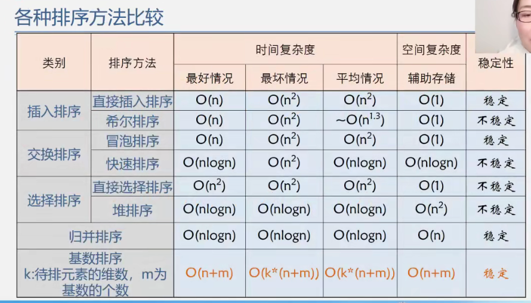

 

> **选择型：简单选择、堆排序**
>
> **插入型：直接插入、折半插入、希尔排序**
>
> **交换型：快速排序、冒泡排序**
>
> **分治型：归并排序**

<!-- more -->



## C++实现

### （一）快速排序

> 版本一

~~~c++
void quickSort(vector<int>& A, int l, int r) {
    if (l >= r) return;
    int i = l, j = r, x = A[l + r >> 1];
    while (i < j) {
        while (A[i] < x) i ++;
        while (A[j] > x) j --;
        if (i <= j) {
            swap(A[i], A[j]);
            i ++;
            j --;
        }
    }
    if (l < j) quickSort(A, l, j);
    if (i < r) quickSort(A, i, r);
}
~~~

> 版本二

```c++
int partition(vector<int>& A, int l, int r) {
    int x = A[l];
    while (l < r) {
        while (l < r && A[r] > x) r --;
        A[l] = A[r];
        while (l < r && A[l] <= x) l ++;
        A[r] = A[l]; 
    }
    A[l] = x;
    return l;
}

void quick_sort(vector<int>& A, int l, int r) {
    if (l < r) {
        int pos = partition(A, l, r);
        quick_sort(A, l, pos - 1);
        quick_sort(A, pos + 1, r);
    }
}
```


### （二）归并排序

```c++
void merge(vector<int> &A, int l1, int r1, int l2, int r2) {
    int len = r2 - l1 + 1;
    vector<int> tmp(len, 0);
    int i = l1, j = l2, idx = 0;
    while (i <= r1 && j <= r2) {
        if (A[i] <= A[j]) {
            tmp[idx++] = A[i++];
        } else {
            tmp[idx++] = A[j++];
        }
    }
    while (i <= r1) tmp[idx++] = A[i++];
    while (j <= r2) tmp[idx++] = A[j++];

    for (int i = 0; i < idx; i ++ ) {
        A[l1 + i] = tmp[i];
    } 
}

void mergeSort(vector<int> &A, int l, int r) {
    if (l < r) {
        int mid = l + r >> 1;
        mergeSort(A, l, mid);
        mergeSort(A, mid + 1, r);
        merge(A, l, mid, mid + 1, r);
    }
}
```


### （三）堆排序

```c++
void adjustDown(vector<int> &A, int low, int high) {
    int i = low, j = 2 * i + 1;
    while (j <= high) {
        if (j + 1 <= high && A[j + 1] > A[j]) {
            j ++;
        }
        if (A[j] > A[i]) {
            swap(A[j], A[i]);
            i = j;
            j = 2 * j + 1;
        } else {
            break;
        }
    }
}

void heapSort(vector<int> &A, int n) {
    for (int i = n / 2 - 1; i >= 0; i -- ) {
        adjustDown(A, i, n - 1);
    }
    for (int i = n - 1; i > 0; i -- ) {
        swap(A[0], A[i]);
        adjustDown(A, 0, i - 1);
    }
}
```


### （四）冒泡排序

```c++
void bubbleSort(vector<int>& A, int n) {
    for (int i = 0; i < n - 1; i ++ ) {
        for (int j = 0; j < n - i - 1; j ++ ) {
            if (A[j] > A[j + 1]) {
                swap(A[j], A[j + 1]);
            }
        }
    }
}
```


### （五）选择排序

```c++
void selectSort(vector<int> &A, int n) {
    for (int i = 0; i < n - 1; i ++ ) {
        int min = i;
        for (int j = i + 1; j < n; j ++ ) {
            if (A[j] < A[min]) {
                min = j;
            }
        }
        if (min != i) {
            swap(A[min], A[i]);
        }
    }
}
```


### （六）直接插入

```c++
void insertSort(vector<int> &A, int n) {
    for (int i = 0; i < n; i ++ ) {
        int tmp = A[i], j;
        for (j = i - 1; j >= 0 && tmp < A[j]; j -- ) {
            A[j + 1] = A[j];
        }
        A[j + 1] = tmp;
    }
}
```


### （七）折半插入

```c++
void halfInsertSort(vector<int> &A, int n) {
    for (int i = 0; i < n; i ++ ) {
        int tmp = A[i], j;
        int l = 0, r = i;
        while (l < r) {
            int mid = l + r >> 1;
            if (A[mid] <= tmp) l = mid + 1;
            else r = mid;
        }
        for (j = i - 1; j >= l; j -- ) {
            A[j + 1] = A[j];
        }
        A[j + 1] = tmp;
    }
}
```


### （八）希尔排序

```c++
void shellSort(vector<int> &A, int n) {
    for (int dk = n / 2; dk >= 1; dk /= 2 ) {
        for (int i = dk; i < n; i ++ ) {
            if (A[i - dk] > A[i]) {
                int tmp = A[i], j;
                for (j = i - dk; j >= 0 && tmp < A[j]; j -= dk ) {
                    A[j + dk] = A[j];
                }
                A[j + dk] = tmp;
            }
        }
    }
}
```

## Java实现

### （一）冒泡排序

```java
public void bubbleSort(int[] arr, int n) {
 	boolean flag = true;
    for (int i = 0; i < n - 1 && flag; i ++ ) {
        flag = false;
        for (int j = 0; j < n - i - 1; j ++ ) {
            if (arr[j] > arr[j + 1]) {
                swap(arr, j, j + 1);
                flag = true;
            }
        }
    }
}

public void swap(int[] arr, int i, int j) {
    int t = arr[i];
    arr[i] = arr[j];
    arr[j] = t;
}
```

### （二）选择排序

```java
public void selectSort(int[] arr, int n) {
    for (int i = 0; i < n - 1; i ++ ) {
        int min = i; // 攻擂台
        for (int j = i; j < n; j ++ ) {
            if (arr[j] < arr[min]) {
                min = j;
            }
        }
        swap(arr, i, min);
    }
}
```

### （三）快速排序

```java
// 方式一：左右互相填充，求出标杆所在的位置，标杆左边小于它，右边大于它
public static int partition(int[] arr, int l, int r) {
    int x = arr[l];
    while (l < r) {
        while (l < r && arr[r] > x) r--;
        arr[l] = arr[r];
        while (l < r && arr[l] <= x) l++;
        arr[r] = arr[l];
    }
    arr[l] = x;
    return l;
}

public static void qSort(int[] arr, int l, int r) {
    if (l >= r) return;
    int pos = partition(arr, l, r);
    qSort(arr, l, pos - 1);
    quickSort(arr, pos + 1, r);
}

// 方式二直接一个函数
public static void quickSort(int[] arr, int l, int r) {
    if (l >= r) return;
    int i = l, j = r, x = arr[l + r >> 1];
    while (i < j) {
        while (arr[i] < x) i++;
        while (arr[j] > x) j--;
        if (i <= j) {
            swap(arr, i, j);
            i++;
            j--;
        }
    }
    if (l < j) quickSort(arr, l, j);
    if (i < r) quickSort(arr, i, r);
}
```

### （四）归并排序

```java
public static void mergeSrt(int[] arr, int l, int r) {
        if (l >= r) return;
        int mid = l + r >> 1;
        mergeSrt(arr, l, mid);
        mergeSrt(arr, mid + 1, r);
        int[] tmp = new int[r - l + 1];
        int i = l, j = mid + 1;
        int idx = 0;
        while (i <= mid && j <= r) {
            if (arr[i] <= arr[j]) {
                tmp[idx++] = arr[i++];
            } else {
                tmp[idx++] = arr[j++];
            }
        }
        while (i <= mid) tmp[idx++] = arr[i++];
        while (j <= r) tmp[idx++] = arr[j++];

        for (int k = 0; k < idx; k ++ ) {
            arr[l + k] = tmp[k];
        }
    }
```

### （五）堆排序

```java
public static void down(int[] arr, int l, int r) {
    int i = l, j = 2 * i + 1;
    while (j <= r) {
        if (j + 1 <= r && arr[j + 1] > arr[j]) {
            j++;
        }
        if (arr[j] > arr[i]) {
            swap(arr, j, i);
            i = j;
            j = 2 * i + 1;
        } else {
            break;
        }
    }
}

public static void heapSort(int[] arr, int n) {
    // 建堆
    for (int i = n / 2 - 1; i >= 0; i -- ) {
        down(arr, i, n - 1);
    }
    for (int i = n - 1; i > 0; i -- ) {
        swap(arr, 0, i);
        down(arr, 0, i - 1);
    }
}
```

### （六）直接插入排序

```java
public static void insertSort(int[] arr, int n) {
    for (int i = 0; i < n; i ++ ) {
        int tmp = arr[i], j;
        for (j = i - 1; j >= 0 && arr[j] > tmp; j -- ) {
            arr[j + 1] = arr[j];
        }
        arr[j + 1] = tmp;
    }
}
```

### （七）折半插入排序

```java
public static void halfInsertSort(int[] arr, int n) {
    for (int i = 0; i < n; i ++ ) {
        int tmp = arr[i], j;
        int l = 0, r = i;
        while (l < r) {
            int mid = l + r >> 1;
            if (arr[mid] <= tmp) l = mid + 1;
            else r = mid;
        }
        for (j = i - 1; j >= l; j -- ) {
            arr[j + 1] = arr[j];
        }
        arr[j + 1] = tmp;
    }
}
```

### （八） 希尔排序

```java
public static void shellSort(int[] arr, int n) {
    for (int dk = n / 2; dk >= 1; dk /= 2 ) {
        for (int i = dk; i < n; i ++ ) {
            if (arr[i - dk] > arr[i]) {
                int tmp = arr[i], j;
                for (j = i - dk; j >= 0 && arr[j] > tmp; j -= dk ) {
                    arr[j + dk] = arr[j];
                }
                arr[j + dk] = tmp;
            }
        }
    }
}
```

## 
