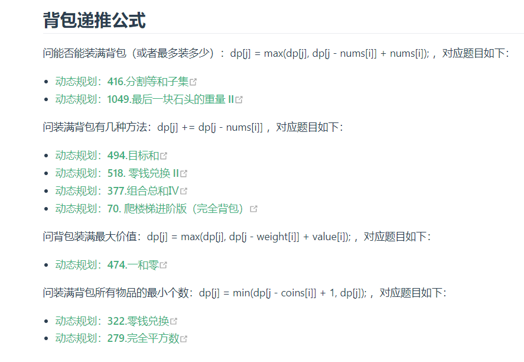
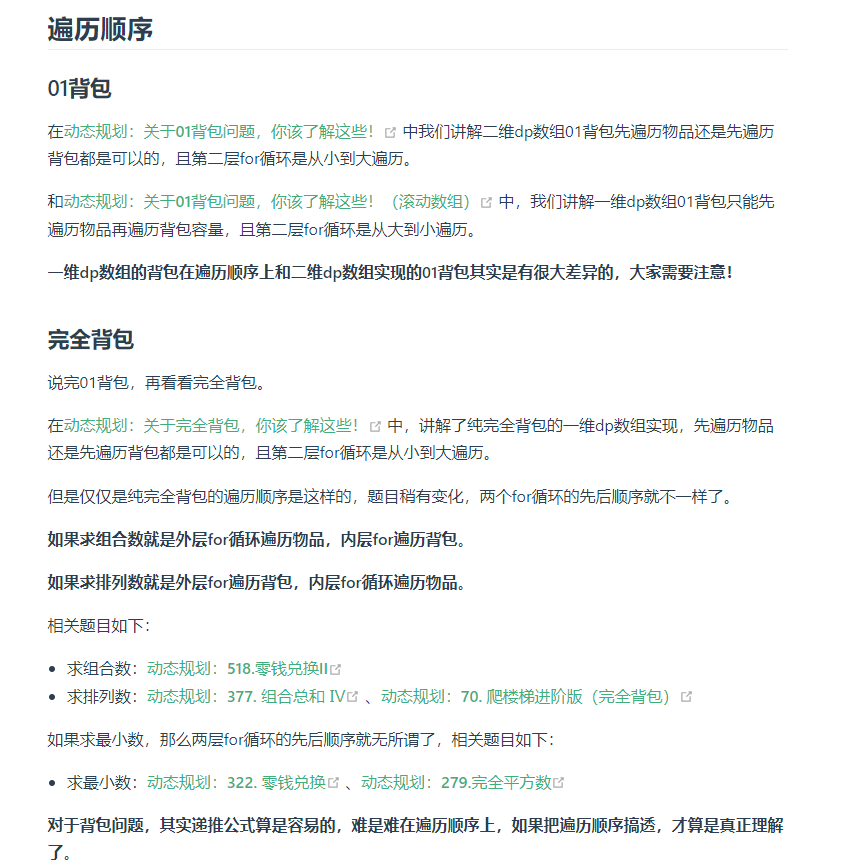

## 背包问题总结

背包类型：01背包、完全背包、多重背包

完全背包：求组合数（外层for是物品、内层for是背包）、求排列数（外层for是背包、内层for是物品）

<!-- more -->

### （1） 背包问题递推公式



### （2）背包问题遍历顺序



### （3）背包问题具体代码

```java
背包问题总结 (一般OJ的数组从0开始， 第一层for循环可以修改为0开始，下面不变)
1、存在型背包： f[j] = f[j] || f[j - v[i]]
2、价值型背包： f[j] = max(f[j], f[j - v[i]] + w[i]) 
				f[j] = max(f[j], f[j - k * v[i]] + k * w[i]) 
3、方案数型背包： f[j] += f[j - v[i]]
4、概率型背包   f[j] = min(f[j], f[j - v[i]] * (1.0 - probability[i])) 
				 //f[j] 表示前i个学校，本金j不中的概率（全部不中） 

背包一（存在型01背包）f[0] = 1  f[1 ~ m] = 0
		for(int i = 1; i <= n; i ++ ) {
            for(int j = m; j >= A[i - 1]; j -- ) {
                f[j] = f[j] || f[j - A[i - 1]];
            }
        }

背包二 (价值型01背包) f[0] = 0   f[1 ~ m] = 0 体积小于等于i的赋值， 不需遍历 f[m] 
					  f[0] = 0   f[1 ~ m] = INF(求最小)/-INF(求最大) 体积恰好为i，要遍历 
						
		for(int i = 1; i <= n; i ++ ) {
			for(int j = m; j >= v[i - 1]; j -- ) {
				f[j] = max(f[j], f[j - v[i - 1]] + w[i - 1]); 
			} 
		}
背包三 （价值型完全背包）f[0] = 0   f[1 ~ m] = 0 体积小于等于i的赋值， 不需遍历 f[m] 
					     f[0] = 0   f[1 ~ m] = INF(求最小)/-INF(求最大) 体积恰好为i，要遍历 
		for(int i = 1; i <= n; i ++ ) {
            for(int j = v[i - 1]; j <= m; j ++ ) {
                f[j] = max(f[j], f[j - v[i - 1]] + w[i - 1]);
            }
        }
        
        (价值型多重背包) f[0] = 0   f[1 ~ m] = 0 体积小于等于i的赋值， 不需遍历 f[m] 
					     f[0] = 0   f[1 ~ m] = INF(求最小)/-INF(求最大) 体积恰好为i，要遍历 
		for(int i = 1; i <= n; i ++ ) {
			for(int j = m; j <= v[i]; j ++ ) {
				for(int k = 0; k <= s[i] && k * v[i] <= j; k ++ ) {
					f[j] = max(f[j], f[j - k * v[i]] + k * w[i]);
				}
			}
		} 

背包四 （方案型完全背包：无限次 + 无顺序）f[0] = 1   f[1 ~ m] = 0
		for(int i = 1; i <= n; i ++ ) {
            for(int j = A[i - 1]; j <= m; j ++ ) {
                f[j] += f[j - A[i - 1]];
            }
        }
/*
在求装满背包有几种方案的时候，认清遍历顺序是非常关键的。

如果求组合数就是外层for循环遍历物品，内层for遍历背包。
如果求排列数就是外层for遍历背包，内层for循环遍历物品。
*/
 
背包五 （方案型01背包：只有一次）f[0] = 1    f[1 ~ m] = 0
		for(int i = 1; i <= n; i ++ ) {
            for(int j = m; j >= A[i - 1]; j -- ) {
                f[j] += f[j - A[i - 1]];
            }
        }

背包六 （方案型完全背包：无限次 + 有顺序）	 f[0] = 1   f[1 ~ m] = 0
		for(int j = 1; j <= m; j ++ ) {  //先遍历体积
            for(int i = 1; i <= n; i ++ ) { //再遍历物品 
                if(j >= A[i - 1]) {
                    f[j] += f[j - A[i - 1]];
                }
            }
        }

背包七	（多重背包:珍爱生活）
		cin >> v[i] >> w[i] >> s[i];
		for(int i = 0; i < n; i ++ ) {
            for(int j = m; j >= v[i]; j -- ) {
                for(int k = 0; k <= s[i] && k * v[i] <= j; k ++ ) {
                    f[j] = max(f[j], f[j - k * v[i]] + k * w[i]);
                }
            }
        } 
	

背包八 统计方案数 （f[i] 表示能否组成i, 另外开数组统计硬币数目） 
		（给一些不同价值和数量的硬币。找出这些硬币可以组合在1 ~ n范围内的值的数量） 
		for(int i = 0; i < n; i ++ ) {
            vector<int> cnt(m + 1, 0);
            for(int j = v[i]; j <= m; j ++ ) {
                if(!f[j] && f[j - v[i]] && cnt[j - v[i]] < s[i]) {
                    f[j] = 1;
                    cnt[j] += cnt[j - v[i]] + 1;
                    res++;
                }
            }
        }
        return res;
      
背包九  （概率背包）
	   vector<double> f(m + 1, 1.0);  //前i个学校， 有n元时， 没有offer的最低概率
       
       for(int i = 1; i <= n; i ++ ) { //0-1背包问题
           for(int j = m; j >= v[i]; j -- ) {
               f[j] = min(f[j], f[j - v[i]] * (1.0 - probability[i]));
           }
       }
       
       return 1 - f[m];        

背包十  （完全背包变形之给小费：总 - max f[i]） 
		int v[3] = {a, b, c}; 
		for(int i = 0; i < 3; i ++ ) {
            for(int j = v[i]; j <= m; j ++ ) {
                f[j] = max(f[j], f[j - v[i]] + v[i]);
            }
        }
        return m - f[m];

背包变形
1】  0-1背包问题的路径打印 （0-1背包的路径打印 （字典序最小如： 123 < 31）） 
	for(int i = n; i >= 1; i -- ) {
        for(int j = 0; j <= m; j ++ ) {
            f[i][j] = f[i + 1][j];
            if(j >= v[i]) {
                f[i][j] = max(f[i][j], f[i + 1][j - v[i]] + w[i]);
            }
        }
    }
    
    int j = m;
    for(int i = 1; i <= n; i ++ ) {
        if(j >= v[i] && f[i][j] == f[i + 1][j - v[i]] + w[i]) {
            cout << i << " ";
            j -= v[i];
        }
    } 
2】  0-1背包最大价值的方案数  
const int N = 1010, INF = 1e9, mod = 1e9 + 7;
int f[N], g[N]; //f[i]表示容量恰好为i时的价值， g[i]表示该容量的方案数

    cin >> n >> m;
    
    for(int i = 1; i <= n; i ++ ) cin >> v[i] >> w[i];
    
    g[0] = 1; //方案
    f[0] = 0; //价值
    for(int i = 1; i <= m; i ++ ) f[i] = -INF;   //恰好为, 求最大值 
    
    for(int i = 1; i <= n; i ++ ) {
        for(int j = m; j >= v[i]; j -- ) {
            // f[j] = max(f[j], f[j - v[i]] + w[i]); 相当于拆开统计
            int maxv = max(f[j], f[j - v[i]] + w[i]);
            int cnt = 0;
            if(maxv == f[j]) cnt += g[j];
            if(maxv == f[j - v[i]] + w[i]) cnt += g[j - v[i]];
            g[j] = cnt % mod;
            f[j] = maxv;
        }
    }
    
    int res = 0;
    for(int i = 0; i <= m; i ++ ) res = max(res, f[i]);
    // cout << res << endl;
    
    int cnt = 0;
    for(int i = 0; i <= m; i ++ ) {
        if(res == f[i]) {
            cnt = (cnt + g[i]) % mod;
        }
    }
    cout << cnt << endl;


 
============================================================= 
1）背包一：（求最大重量，01背包存在性问题） 
在n个物品中挑选若干物品装入背包，最多能装多满？
假设背包的大小为m，每个物品的大小为A[i] 

样例 1:
	输入:  [3,4,8,5], backpack size=10
	输出:  9

样例 2:
	输入:  [2,3,5,7], backpack size=12
	输出:  12
	
	
class Solution {
public:
    /**
     * @param m: An integer m denotes the size of a backpack
     * @param A: Given n items with size A[i]
     * @return: The maximum size
     */
    int backPack(int m, vector<int> &A) {
        // int n = A.size();
        
        // if(n == 0) {
        //     return 0;
        // }
        
        // int f[n + 1][m + 1];
        
        // for(int i = 1; i <= m; i ++ ) {
        //     f[0][i] = 0;
        // }
        
        // f[0][0] = 1;
        
        // for(int i = 1; i <= n; i ++ ) {
        //     for(int j = 0; j <= m; j ++ ) {
        //         f[i][j] = f[i - 1][j];
        //         if(j >= A[i - 1]) {
        //             f[i][j] = f[i][j] || f[i - 1][j - A[i - 1]];
        //         }
        //     }
        // }
        
        // for(int i = m; i >= 0; i -- ) {
        //     if(f[n][i]) {
        //         return i;
        //     }
        // }
        
        // return 0;
        int n = A.size();
        if(n == 0) return 0;
        
        bool f[m + 1]; //能否装体积恰好是i
        
        for(int i = 1; i <= m; i ++ ) f[i] = 0; //恰好装满体积i的初始条件
        
        f[0] = 1;
        
        for(int i = 1; i <= n; i ++ ) {
            for(int j = m; j >= A[i - 1]; j -- ) {
                f[j] = f[j] || f[j - A[i - 1]];
            }
        }
        
        for(int i = m; i >= 0; i -- ) {
            if(f[i] == 1) {
                return i;
            }
        }
        
        return 0;
    }
};


2）背包二：（求价值， 01背包） 
有 n 个物品和一个大小为 m 的背包. 
给定数组 A 表示每个物品的大小和数组 V 表示每个物品的价值.
问最多能装入背包的总价值是多大? 每个物品只能取一次

样例 1:

输入: m = 10, A = [2, 3, 5, 7], V = [1, 5, 2, 4]
输出: 9
解释: 装入 A[1] 和 A[3] 可以得到最大价值, V[1] + V[3] = 9 
样例 2:

输入: m = 10, A = [2, 3, 8], V = [2, 5, 8]
输出: 10
解释: 装入 A[0] 和 A[2] 可以得到最大价值, V[0] + V[2] = 10

class Solution {
public:
    /**
     * @param m: An integer m denotes the size of a backpack
     * @param A: Given n items with size A[i]
     * @param V: Given n items with value V[i]
     * @return: The maximum value
     */
    int backPackII(int m, vector<int> &v, vector<int> &w) {
        if(v.empty() || w.empty()) return 0;
        
        int n = v.size();
        
        int f[m + 1];  //体积为 i 的最大价值（可以不装满）
        
        for(int i = 0; i <= m; i ++ ) {
            f[i] = 0;
        }
        
        for(int i = 1; i <= n; i ++ ) {
            for(int j = m; j >= v[i - 1]; j -- ) {
                f[j] = max(f[j], f[j - v[i - 1]] + w[i - 1]);
            }
        }
        
        return f[m];
        // if(v.empty() || w.empty()) return 0;
        
        // int n = v.size();
        
        // int f[n + 1][m + 1];  //f[i][j] 表示前 i 物品,组成 体积为 j的最大价值 
        
        // for(int i = 1; i <= m; i ++ ) f[0][i] = -1;
        
        // f[0][0] = 0;
        // for(int i = 1; i <= n; i ++ ) {
        //     for(int j = 0; j <= m; j ++ ) {
        //         f[i][j] = f[i - 1][j];
        //         if(j >= v[i - 1] && f[i - 1][j - v[i - 1]] != -1) {
        //             f[i][j] = max(f[i][j], f[i - 1][j - v[i - 1]] + w[i - 1]);
        //         }
        //     }
        // }
        
        // int res = 0;
        // for(int i = 0; i <= m; i ++ ) {
        //     res = max(res, f[n][i]);
        // }
        
        // return res;
        
        // int n = v.size();
        
        // if(n == 0) {
        //     return 0;
        // }
        
        // int f[n + 1][m + 1];
        // int g[n + 1][m + 1];
        
        // f[0][0] = 0;
        // for(int i = 1; i <= m ;i ++ ) {
        //     f[0][i] = 0;
        // }
        
        // for(int i = 1; i <= n; i ++ ) {
        //     for(int j = 0; j <= m; j ++ ) {
        //         f[i][j] = f[i - 1][j];
        //         g[i][j] = 0;
        //         if(j >= v[i - 1]) {
        //             f[i][j] = max(f[i][j], f[i - 1][j - v[i - 1]] + w[i - 1]);
        //             if(f[i][j] == f[i - 1][j - v[i - 1]] + w[i - 1]) {
        //                 g[i][j] = 1;
        //             }
        //         }
        //     }
        // }
        
        // int j = m;
        // int path[n];
        // for(int i = n; i >= 1; i -- ) {
        //     if(g[i][j] == 1) {
        //         path[i - 1] = true;
        //         j -= v[i - 1];
        //     } else {
        //         path[i - 1] = false;
        //     }
        // }
        
        // for(int i = 0; i < n; i ++ ) {
        //     // if(path[i] == 1) {
        //     //     printf("%d %d\n",v[i], w[i]);
        //     // }
        //   if(path[i] == 1) {
        //       cout << "item " << i << " " << v[i] << " " << w[i] << endl;
        //   }
        // } 

        // return f[n][m];
        // int n = v.size();
        // if(n == 0) {
        //     return 0;
        // }
        
        // int f[m + 1];
        
        // memset(f, 0, sizeof(f));
        
        // for(int i = 1; i <= n; i ++ ) {
        //     for(int j = m; j >= v[i - 1]; j -- ) {
        //         f[j] = max(f[j], f[j - v[i - 1]] + w[i - 1]);
        //     }
        // }
        
        // return f[m];
    }
};

3）背包三：（完全背包问题） 
给定 n 种物品, 每种物品都有无限个. 第 i 个物品的体积为 A[i], 价值为 V[i].

再给定一个容量为 m 的背包. 问可以装入背包的最大价值是多少?

样例 1:

输入: A = [2, 3, 5, 7], V = [1, 5, 2, 4], m = 10
输出: 15
解释: 装入三个物品 1 (A[1] = 3, V[1] = 5), 总价值 15.
样例 2:

输入: A = [1, 2, 3], V = [1, 2, 3], m = 5
输出: 5
解释: 策略不唯一. 比如, 装入五个物品 0 (A[0] = 1, V[0] = 1). 

class Solution {
public:
    /**
     * @param A: an integer array
     * @param V: an integer array
     * @param m: An integer
     * @return: an array
     */
    int backPackIII(vector<int> &v, vector<int> &w, int m) {
        if(v.empty() || w.empty()) return 0;
        
        int n = v.size();
        
        int f[m + 1];   //f[i] 表示背包体积是 i 的最大价值（背包体积可以不装满）
        
        for(int i = 0; i <= m; i ++ ) {
            f[i] = 0;
        }
        
        for(int i = 1; i <= n; i ++ ) {
            for(int j = v[i - 1]; j <= m; j ++ ) {
                f[j] = max(f[j], f[j - v[i - 1]] + w[i - 1]);
            }
        }
        
        return f[m];
        
        // int n = v.size();
        
        // if(n == 0) {
        //     return 0;
        // }
        
        // int f[n + 1][m + 1];
        
        // memset(f, 0, sizeof(f)); 
        
        // for(int i = 1; i <= n; i ++ ) {
        //     for(int j = 0; j <= m; j ++ ) {
        //         for(int k = 0; k * v[i - 1] <= j; k ++ ) {
        //             f[i][j] = max(f[i][j], f[i - 1][j - v[i - 1] * k] + w[i - 1] * k);
        //         }
        //     }
        // }
        
        // return f[n][m];
    }
};

背包三-2 多重背包问题
	for(int i = 1; i <= n; i ++ ) {
		for(int j = m; j >= v[i]; j -- ) {
			for(int k = 0; k * v[i] <= j && k <= s[i]; k ++ ) {
				f[j] = max(f[j], f[j - v[i] * k] + w[i] * k);
			}
		}
	}
	cout << f[m]; 

4）背包四 （无限次 + 不考虑顺序） 
给出 n 个物品, 以及一个数组, nums[i]代表第i个物品的大小, 
保证大小均为正数并且没有重复, 正整数 target 表示背包的大小, 
找到能填满背包的方案数。
每一个物品可以使用无数次

样例1

输入: nums = [2,3,6,7] 和 target = 7
输出: 2
解释:
方案有: 
[7]
[2, 2, 3]
样例2

输入: nums = [2,3,4,5] 和 target = 7
输出: 3
解释:
方案有: 
[2, 5]
[3, 4]
[2, 2, 3]

class Solution {
public:
    /**
     * @param nums: an integer array and all positive numbers, no duplicates
     * @param target: An integer
     * @return: An integer
     */
    int backPackIV(vector<int> &A, int m) {
        
        // vector<int> dp(target + 1);
        // dp[0] = 1;
        // for (auto a : nums) {
        //     for (int i = a; i <= target; ++i) {
        //         dp[i] += dp[i - a];
        //     }
        // }
        // return dp.back();
        
        if(A.empty()) return 0;
        
        int n = A.size();
        
        int f[m + 1]; // f[i] 表示恰好体积为 i 的方案数
        
        for(int i = 1; i <= m; i ++ ) {
            f[i] = 0;
        }
        
        f[0] = 1;
        
        for(int i = 1; i <= n; i ++ ) {
            for(int j = A[i - 1]; j <= m; j ++ ) {
                f[j] += f[j - A[i - 1]];
            }
        }
    
        return f[m];
       
     }
     
};


5）背包五 （只能用一次） 
给出 n 个物品, 以及一个数组, nums[i] 代表第i个物品的大小, 保证大小均为正数,
 正整数 target 表示背包的大小, 找到能填满背包的方案数。
每一个物品只能使用一次

样例
给出候选物品集合 [1,2,3,3,7] 以及 target 7

结果的集合为:
[7]
[1,3,3]
返回 2

class Solution {
public:
    /**
     * @param nums: an integer array and all positive numbers
     * @param target: An integer
     * @return: An integer
     */
    int backPackV(vector<int> &A, int m) {
        // int n = A.size();
        
        // if(n == 0) {
        //     return 0;
        // }
        
        // int f[n + 1][m + 1]; //前i 个物品拼出 重量位j的方式数目（不是存在性）
        
        // f[0][0] = 1;
        // //前0个物品拼不出任何重量[1 ~ m] 
        // for(int i = 1; i <= m; i ++ ) {
        //     f[0][i] = 0; 
        // }
        
        // for(int i = 1; i <= n; i ++ ) {
        //     for(int j = 0; j <= m; j ++ ) {
        //         f[i][j] = f[i - 1][j];
        //         if(j >= A[i - 1]) {
        //             // f[i][j] = max(f[i][j], f[i - 1][j - v[i]] + w[i]);   //0~1背包问题
        //             f[i][j] = f[i][j] + f[i - 1][j - A[i - 1]];
        //         }
        //     }
        // }
        
        // return f[n][m];
        /*
        vector<int> dp(target + 1);
        dp[0] = 1;
        for (auto a : nums) {
            for (int i = target; i >= a; --i) {
                dp[i] += dp[i - a];
            }
        }
        return dp.back();
        */
        // int n = A.size();
        
        // if(n == 0) {
        //     return 0;
        // }
        
        // int f[m + 1];
        
        // f[0] = 1;
        
        // for(int i = 1; i <= m; i ++ ) {
        //     f[i] = 0;
        // }
        
        // for(int i = 1; i <= n; i ++ ) {
        //     for(int j = m; j >= A[i - 1]; j -- ) {
        //         f[j] += f[j - A[i - 1]];
        //     }
        // }
        
        // return f[m];
        if(A.empty()) return 0;
        
        int n = A.size();
        
        int f[m + 1]; // 01背包， f[i] 表示体积恰好为i的方案数目
        
        for(int i = 1; i <= m; i ++ ) {
            f[i] = 0;
        }
        
        f[0] = 1;
        
        for(int i = 1; i <= n; i ++ ) {
            for(int j = m; j >= A[i - 1]; j -- ) {
                f[j] += f[j - A[i - 1]];
            }
        }
        
        return f[m];
    }
};

6） 背包六 （无限次 + 考虑顺序） 
给出一个都是正整数的数组 nums，其中没有重复的数。
从中找出所有的和为 target 的组合个数。
一个数可以在组合中出现多次。
数的顺序不同则会被认为是不同的组合。

样例1

输入: nums = [1, 2, 4] 和 target = 4
输出: 6
解释:
可能的所有组合有：
[1, 1, 1, 1]
[1, 1, 2]
[1, 2, 1]
[2, 1, 1]
[2, 2]
[4]
样例2

输入: nums = [1, 2] 和 target = 4
输出: 5
解释:
可能的所有组合有：
[1, 1, 1, 1]
[1, 1, 2]
[1, 2, 1]
[2, 1, 1]
[2, 2]

class Solution {
public:
    /**
     * @param nums: an integer array and all positive numbers, no duplicates
     * @param target: An integer
     * @return: An integer
     */
    int backPackVI(vector<int> &A, int m) {
        /*
        vector<int> dp(target + 1);
        dp[0] = 1;
        for (int i = 1; i <= target; ++i) {
            for (auto a : nums)
            if (i >= a) {
                dp[i] += dp[i - a];
            }
        }
        return dp.back();
        */
        if(A.empty() || A.size() == 0 || m == 0 ) return 0;
        
        int f[m + 1];  //体积为恰好为 i 的，的无限次的，有顺序的方案数
        
        int n = A.size();
        
        for(int i = 1; i <= m ; i ++ ) {
            f[i] = 0;
        }
        
        f[0] = 1;
        
        for(int j = 1; j <= m; j ++ ) {  //先遍历体积
            for(int i = 1; i <= n; i ++ ) {
                if(j >= A[i - 1]) {
                    f[j] += f[j - A[i - 1]];
                }
            }
        }
        
        return f[m];
    }
};

7）背包 VII （多重背包） 

假设你身上有 n 元，超市里有多种大米可以选择，每种大米都是袋装的，必须整袋购买，
给出每种大米的价格，重量以及数量，求最多能买多少公斤的大米

样例 1:

输入:  n = 8, prices = [3,2], weights = [300,160], amounts = [1,6]
输出:  640	
解释:  全买价格为2的米。
样例 2:

输入:  n = 8, prices  = [2,4], weight = [100,100], amounts = [4,2 ]
输出:  400	
解释:  全买价格为2的米	

class Solution {
public:
    /**
     * @param n: the money of you
     * @param prices: the price of rice[i]
     * @param weight: the weight of rice[i]
     * @param amounts: the amount of rice[i]
     * @return: the maximum weight
     */
    int backPackVII(int m, vector<int> &v, vector<int> &w, vector<int> &s) {
        if(w.empty() || v.empty() || s.empty()|| m == 0) return 0;
        
        int n = v.size();
        
        vector<int> f(m + 1);
        
        f[0] = 0;
        for(int i = 1; i <= m; i ++ ) f[i] = 0;
        
        for(int i = 0; i < n; i ++ ) {
            for(int j = m; j >= v[i]; j -- ) {
                for(int k = 0; k <= s[i] && k * v[i] <= j; k ++ ) {
                    f[j] = max(f[j], f[j - k * v[i]] + k * w[i]);
                }
            }
        }
        return f[m];
    }
}; 

8）背包 VIII
给一些不同价值和数量的硬币。找出这些硬币可以组合在1 ~ n范围内的值的数量

样例 1:
	输入:  
		n = 5
		value = [1,4]
		amount = [2,1]
	输出:  4
	
	解释:
	可以组合出1，2，4，5

样例 2:
	输入: 
		n = 10
		value = [1,2,4]
		amount = [2,1,1]
	输出:  8
	
	解释:
	可以组合出1-8所有数字。

class Solution {
public:
    /**
     * @param n: the value from 1 - n
     * @param value: the value of coins
     * @param amount: the number of coins
     * @return: how many different value
     */
    int backPackVIII(int m, vector<int> &v, vector<int> &s) {
        int n = v.size();
        
        vector<int> f(m + 1, 0); // 是否存在方案，组成m
        
        f[0] = 1;
        for(int i = 1; i <= m; i ++ ) f[i] = 0;
        
        int res = 0;
        
        for(int i = 0; i < n; i ++ ) {
            vector<int> cnt(m + 1, 0);
            for(int j = v[i]; j <= m; j ++ ) {
                if(!f[j] && f[j - v[i]] && cnt[j - v[i]] < s[i]) {
                    f[j] = 1;
                    cnt[j] += cnt[j - v[i]] + 1;
                    res++;
                }
            }
        }
        return res;
    }
};


9）背包 IX（概率）

你总共有n元，商人总共有三种商品，它们的价格分别是150元,250元,350元，
三种商品的数量可以认为是无限多的，购买完商品以后需要将剩下的钱给商人作为小费，
求最少需要给商人多少小费

您在真实的面试中是否遇到过这个题？  
样例
样例 1:

输入:  n = 900
输出:  0
样例 2:

输入:  n = 800
输出:  0
class Solution {
public:
    /**
     * @param n: Your money
     * @param prices: Cost of each university application
     * @param probability: Probability of getting the University's offer
     * @return: the  highest probability
     */
    double backpackIX(int m, vector<int> &v, vector<double> &probability) {
       //至少获得一份offer的最高可能 = 1 - 全部都获取不了的最低可能
       int n = v.size();
       
       vector<double> f(m + 1, 1.0);  //前i个学校， 有n元时， 没有offer的最低概率
       
       for(int i = 1; i <= n; i ++ ) { //0-1背包问题
           for(int j = m; j >= v[i - 1]; j -- ) {
               f[j] = min(f[j], f[j - v[i - 1]] * (1.0 - probability[i - 1]));
           }
       }
       
       return 1 - f[m];
    }
}; 

10）背包 X 
你总共有n元，商人总共有三种商品，它们的价格分别是150元,250元,350元，
三种商品的数量可以认为是无限多的，购买完商品以后需要将剩下的钱给商人作为小费，
求最少需要给商人多少小费

样例
样例 1:

输入:  n = 900
输出:  0
样例 2:

输入:  n = 800
输出:  0


class Solution {
public:
    /**
     * @param n: the money you have
     * @return: the minimum money you have to give
     */
    int backPackX(int m) {
        int v[3] = {150, 250, 350};
        //最少给小费，即求最大消费 (m - f[m])
        
        vector<int> f(m + 1);
        
        f[0] = 0;
        for(int i = 1; i <= m; i ++ ) f[i] = 0;
        
        for(int i = 0; i < 3; i ++ ) {
            for(int j = v[i]; j <= m; j ++ ) {
                f[j] = max(f[j], f[j - v[i]] + v[i]);
            }
        }
        return m - f[m];
    }
};

11） 0-1背包问题的路径打印 （0-1背包的路径打印 （字典序最小如： 123 < 31）） 
	for(int i = n; i >= 1; i -- ) {
        for(int j = 0; j <= m; j ++ ) {
            f[i][j] = f[i + 1][j];
            if(j >= v[i]) {
                f[i][j] = max(f[i][j], f[i + 1][j - v[i]] + w[i]);
            }
        }
    }
    
    int j = m;
    for(int i = 1; i <= n; i ++ ) {
        if(j >= v[i] && f[i][j] == f[i + 1][j - v[i]] + w[i]) {
            cout << i << " ";
            j -= v[i];
        }
    } 

12)  0-1背包最大价值的方案数 
#include <bits/stdc++.h>

using namespace std;

const int N = 1010, INF = 1e9, mod = 1e9 + 7;
int v[N], w[N];
int f[N], g[N]; //f[i]表示容量恰好为i时的价值， g[i]表示该容量的方案数
int n, m;

int main() {
    
    cin >> n >> m;
    
    for(int i = 1; i <= n; i ++ ) cin >> v[i] >> w[i];
    
    g[0] = 1; //方案
    f[0] = 0; //价值
    for(int i = 1; i <= m; i ++ ) f[i] = -INF;   //恰好为, 求最大值 
    
    for(int i = 1; i <= n; i ++ ) {
        for(int j = m; j >= v[i]; j -- ) {
            // f[j] = max(f[j], f[j - v[i]] + w[i]); 相当于拆开统计
            int maxv = max(f[j], f[j - v[i]] + w[i]);
            int cnt = 0;
            if(maxv == f[j]) cnt += g[j];
            if(maxv == f[j - v[i]] + w[i]) cnt += g[j - v[i]];
            g[j] = cnt % mod;
            f[j] = maxv;
        }
    }
    
    int res = 0;
    for(int i = 0; i <= m; i ++ ) res = max(res, f[i]);
    // cout << res << endl;
    
    int cnt = 0;
    for(int i = 0; i <= m; i ++ ) {
        if(res == f[i]) {
            cnt = (cnt + g[i]) % mod;
        }
    }
    cout << cnt << endl;
     
    return 0;
}
```

